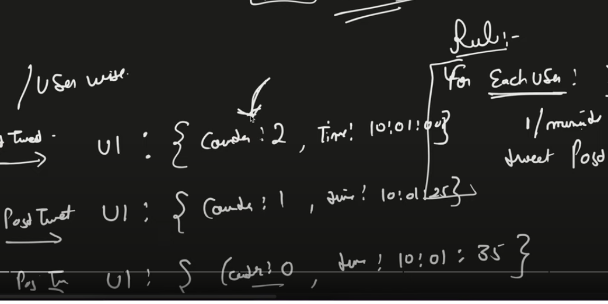
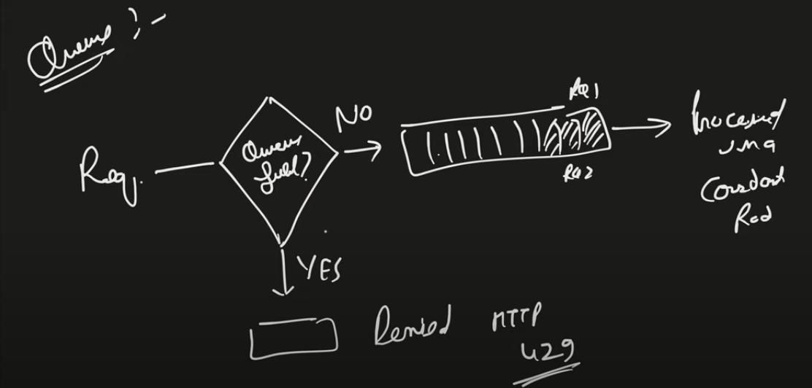
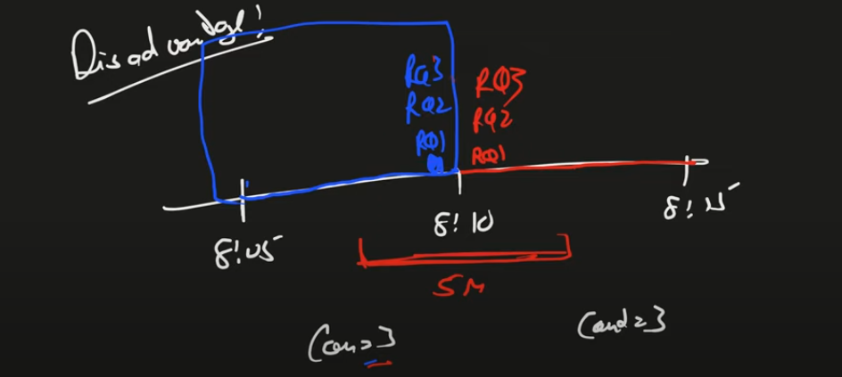
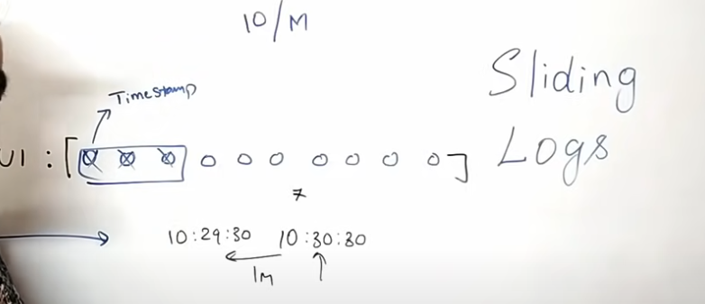
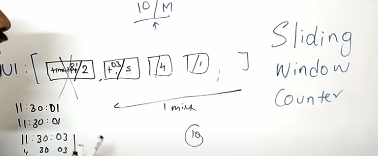
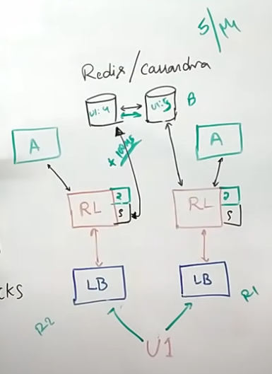

**Why Required ?**
- To prevent DDOS attack 

**It has 5 Algorithms:**

- Token Bucket Algorithm
- Leaking Bucket Algorithm
- Fixed Window Counter Algorithm
- Sliding Window Logs Algorithm
- Sliding Window Counter Algorithm

**Token Bucket**

- We have a bucket with limited capacity to hold tokens which gets refilled after defined interval.
- Can be implemented using Redis but atomicity is the concern
- U1 : 11::00::01-3 (timestamp-counter)

**Leaking Bucket**

- Implemented using FIFO whose out will be at a predefined interval

**Fixed Window Counter**

- Implemented using Redis
- U1-11::00 (user-minute) : 3 (counter)
- U1-11::01 (uset-nextMinute) : 0 (counter)

**Sliding Window Logs**

- Can be implemented using hash table/redis
- Not m/o efficient

**Sliding Window Counter**

**Problems with Rate Limiter

- Inconsistency : Can be solved using sticky session at LB
- Race condition : Can be avoided using locks but adds to latency

