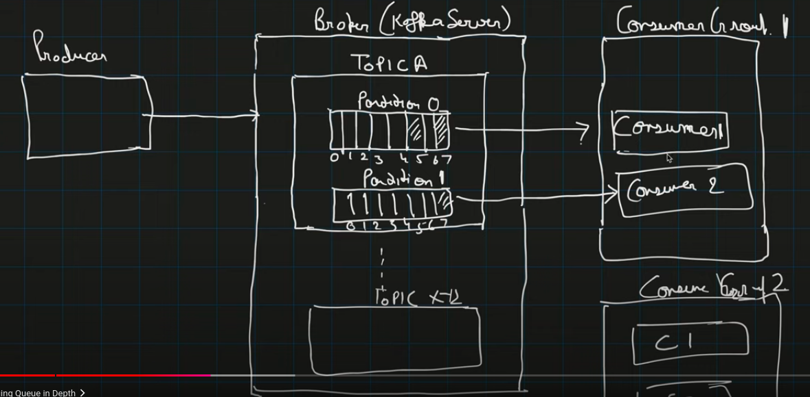
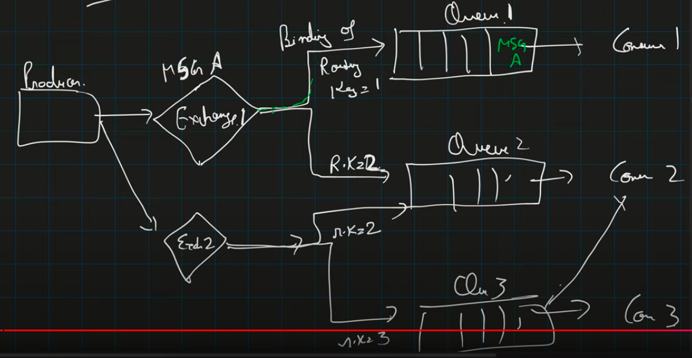

## **Distributed Messaging Queues**

### **What is a Distributed Messaging Queue?**

A distributed messaging queue is a communication mechanism that allows different parts of a distributed system to communicate asynchronously. It enables services to send and receive messages without requiring both the sender and receiver to be available simultaneously.

### **Why message queues are needed**

- To bring async nature and retry capability
- Can act as a throttle or pace matcher
- **Additional benefits**:
  - **Decoupling**: Services don't need direct knowledge of each other
  - **Scalability**: Can handle varying loads by buffering messages
  - **Resilience**: System can continue functioning even if some components fail
  - **Load leveling**: Handles traffic spikes without overwhelming receivers
  - **Ordered delivery**: Ensures messages are processed in the correct sequence (when needed)
  - **Guaranteed delivery**: Messages aren't lost even if components temporarily fail

### **Core Concepts in Messaging Systems**

1. **Message**: A piece of data sent between applications
   - Contains payload (actual data) and metadata (headers, routing information)
   - Can be simple (text, JSON) or complex (binary, serialized objects)
   - May include properties like priority, expiration, correlation IDs

2. **Queue**: A buffer that stores messages until they're consumed
   - FIFO (First-In-First-Out) by default in most systems
   - Can be persistent (survives broker restarts) or transient
   - May have properties like maximum size, TTL, or access controls

3. **Producer**: Application that creates and sends messages to the queue
   - Can publish to multiple queues
   - May specify message properties like routing keys or priorities

4. **Consumer**: Application that receives and processes messages from the queue
   - Can subscribe to multiple queues
   - May acknowledge message receipt or processing

5. **Broker**: Server that hosts queues and handles message routing
   - Manages message persistence
   - Handles consumer connections and message delivery
   - Often clustered for high availability

### **Messaging Patterns**

#### **Point to point and Pub-sub**

- When message is published to a queue, in p2p any one of the consumers attached to the queue can consume it and then it is removed from queue but in pub-sub when all attached consumers consume the message then only it is removed from queue
- **Point-to-Point (Queue) Model**:
  - Each message is delivered to exactly one consumer
  - Multiple consumers form a competing consumer pattern
  - Good for work distribution and load balancing
  - Example: Task queues where each task should be processed once

- **Publish-Subscribe (Topic) Model**:
  - Each message is delivered to all active subscribers
  - Subscribers can filter messages based on topics or content
  - Good for event distribution and notifications
  - Example: News feeds, status updates, monitoring events

#### **Additional Messaging Patterns**

1. **Request-Reply**:
   - Client sends a request message and waits for a reply
   - Often implemented with temporary reply queues
   - Example: RPC (Remote Procedure Call) over messaging

2. **Competing Consumers**:
   - Multiple consumers read from the same queue
   - Each message goes to only one consumer
   - Enables parallel processing and load balancing
   - Example: Worker pools processing tasks

3. **Message Routing**:
   - Messages are routed based on content or metadata
   - Can implement complex routing logic
   - Example: Content-based routing in enterprise integration

4. **Scatter-Gather**:
   - Request is sent to multiple recipients
   - Responses are collected and aggregated
   - Example: Parallel search across multiple databases

### **Popular Messaging Systems**

#### **Understanding Kafka**

- Every node has a broker and group of nodes is a cluster which is maintained by zookeeper
- A message have : key, value, topicName, partitionName. Based on key or partitionName, a message is routed to a particular partition of a topic
- Zookeeper maintains inside a consumerGroup which consumer has read from which topic's partition upto which offset (Commited offset)
- This helps zookeeper to redirects messages incase of failure of a consumer in a particular consumerGroup. Within a consumerGroup, if a consumer goes down, messages are redirected to another consumer of same group
- In a cluster, every topic's partition has a replica on other broker.
- Kafka/pulsar is a pull based approach but RabbitMQ is a push based approach

**Additional Kafka Details**:
- **Log-Based Architecture**: Topics are implemented as append-only logs
- **High Throughput**: Can handle millions of messages per second
- **Data Retention**: Messages can be retained for configurable periods
- **Exactly-Once Semantics**: Supports exactly-once processing with transactions
- **Stream Processing**: Native support via Kafka Streams and KSQL
- **Use Cases**: Event sourcing, log aggregation, stream processing, metrics collection
- **Key Components**:
  - **Topic**: A category or feed name to which records are published
  - **Partition**: Topics are split into partitions for parallelism
  - **Consumer Group**: Group of consumers that divides the work of processing
  - **Offset**: Position of a consumer in a partition
  - **Broker**: Kafka server that stores data and serves clients

#### **Understanding RabbitMQ**

- There are different types of exchange
  - FanOut exchange - Msg will be pushed to all queues associated with this exchange
  - Direct exchange - Msg will be pushed to the queue with same routing key as that of the msg key
  - Topic exchange - We can use wildcards as a binding between routing key and msg key

**Additional RabbitMQ Details**:
- **AMQP Protocol**: Based on Advanced Message Queuing Protocol
- **Flexible Routing**: Complex routing with exchanges and bindings
- **Message Acknowledgments**: Ensures reliable delivery
- **Queue Features**: Priorities, TTL, DLX (Dead Letter Exchange)
- **Plugin System**: Extensible with plugins for management, shovel, federation
- **Use Cases**: Task distribution, microservices communication, complex routing needs
- **Key Components**:
  - **Exchange**: Receives messages and routes them to queues
  - **Binding**: Rules that exchanges use to route messages to queues
  - **Queue**: Buffer that stores messages
  - **Virtual Host**: Isolated environment with its own exchanges, queues, and permissions
  - **Additional Exchange Types**:
    - **Headers Exchange**: Routes based on message header values
    - **Consistent Hashing Exchange**: Routes based on consistent hash of routing key

#### **Other Popular Messaging Systems**

1. **Apache Pulsar**:
   - Unified messaging and streaming platform
   - Multi-tenancy support
   - Geo-replication capabilities
   - Tiered storage architecture

2. **Amazon SQS/SNS**:
   - Fully managed messaging services
   - SQS for queues, SNS for pub/sub
   - Seamless integration with AWS services
   - Automatic scaling and high availability

3. **Google Pub/Sub**:
   - Globally distributed messaging
   - At-least-once delivery semantics
   - Automatic scaling
   - Integrated with Google Cloud

4. **ActiveMQ/Artemis**:
   - JMS-compliant message broker
   - Multiple protocol support
   - Advanced clustering and high availability
   - Enterprise integration patterns

### **Delivery Guarantees**

1. **At-Most-Once Delivery**:
   - Messages may be lost but never delivered twice
   - Highest performance, lowest reliability
   - Example: Metrics collection where some loss is acceptable

2. **At-Least-Once Delivery**:
   - Messages are never lost but may be delivered multiple times
   - Requires consumer idempotency
   - Example: Payment processing where missing a payment is unacceptable

3. **Exactly-Once Delivery**:
   - Messages are delivered exactly once
   - Hardest to implement, often requires transactions
   - Example: Financial transactions where duplicates are problematic

### **Challenges and Solutions**

1. **Message Ordering**:
   - **Challenge**: Maintaining message order across distributed systems
   - **Solutions**:
     - Single partition/queue for strict ordering
     - Sequence numbers and reordering buffers
     - Partitioning by correlation key

2. **Duplicate Messages**:
   - **Challenge**: Handling duplicate messages due to retries
   - **Solutions**:
     - Idempotent consumers
     - Deduplication based on message IDs
     - Transaction logs

3. **Dead Letter Queues**:
   - **Challenge**: Handling messages that can't be processed
   - **Solutions**:
     - Route to dead letter queue after retry limit
     - Monitor and alert on DLQ activity
     - Implement retry with backoff strategies

4. **Scalability**:
   - **Challenge**: Scaling to handle increasing message volumes
   - **Solutions**:
     - Partitioning/sharding
     - Consumer groups
     - Clustered brokers

5. **Monitoring and Observability**:
   - **Challenge**: Understanding system behavior and performance
   - **Solutions**:
     - Queue depth monitoring
     - Consumer lag metrics
     - End-to-end tracing
     - Message rate and latency tracking

### **Implementation Best Practices**

1. **Message Design**:
   - Keep messages small and focused
   - Include correlation IDs for tracking
   - Use schemas for message validation
   - Consider versioning for evolution

2. **Error Handling**:
   - Implement retry with exponential backoff
   - Use circuit breakers for failing dependencies
   - Create dead letter queues for unprocessable messages
   - Log detailed error information

3. **Performance Optimization**:
   - Batch messages when possible
   - Use consumer prefetch/batching
   - Consider message compression
   - Tune broker and client configurations

4. **Security Considerations**:
   - Implement authentication and authorization
   - Encrypt sensitive message content
   - Use TLS for transport security
   - Audit message access and operations

5. **Operational Practices**:
   - Monitor queue depths and processing rates
   - Set up alerts for abnormal conditions
   - Implement graceful degradation strategies
   - Plan for disaster recovery

### **Real-World Use Cases**

1. **Microservices Communication**:
   - Asynchronous communication between services
   - Event-driven architecture implementation
   - Command and event distribution

2. **Task Processing**:
   - Background job processing
   - Distributed work allocation
   - Long-running operations

3. **Data Integration**:
   - ETL processes
   - Change data capture
   - Cross-system synchronization

4. **IoT Data Processing**:
   - Ingesting sensor data
   - Command distribution to devices
   - Telemetry processing

5. **Real-time Analytics**:
   - Event streaming for analytics
   - Metrics collection and aggregation
   - Real-time dashboards and alerts

### **Conclusion**

Distributed messaging queues are a fundamental building block for modern distributed systems. They enable loose coupling, improve scalability and resilience, and provide a foundation for event-driven architectures. By understanding the different messaging patterns, delivery guarantees, and implementation considerations, you can effectively leverage messaging systems to build robust and scalable applications.
