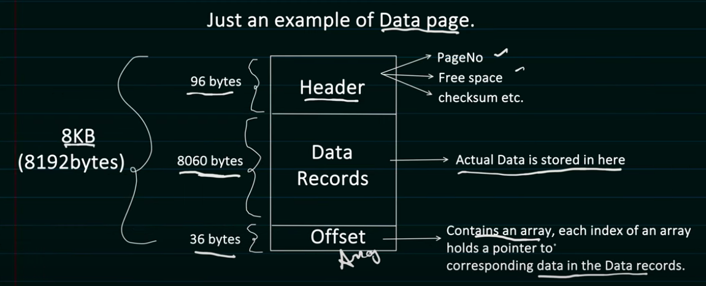
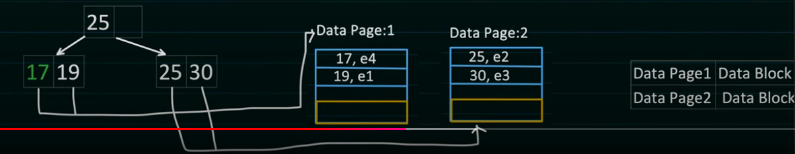
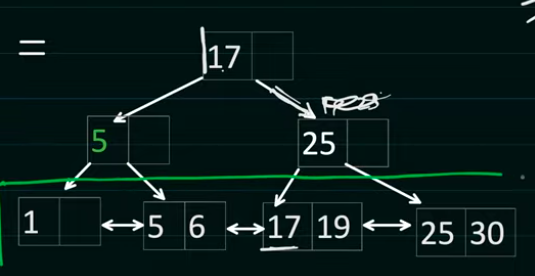
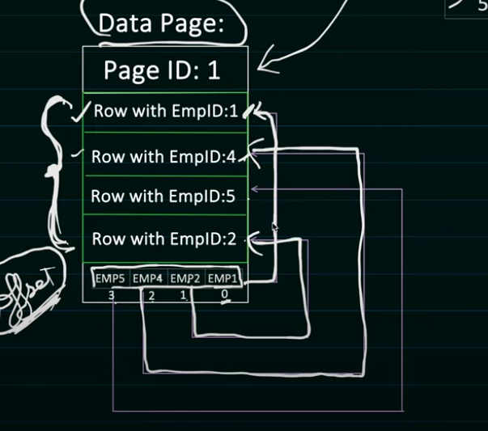

## **Database Indexing**

### **What is Database Indexing?**

Database indexing is a data structure technique that improves the speed of data retrieval operations on a database table. Indexes are created using one or more columns of a database table, providing the basis for both rapid random lookups and efficient access to ordered records.

### **Why Indexing is Important**

1. **Query Performance**: Dramatically speeds up data retrieval operations
2. **Sorting Efficiency**: Enables efficient sorting of results
3. **Unique Constraints**: Enforces uniqueness of values in columns
4. **Join Operations**: Accelerates table joins by quickly locating matching records
5. **Aggregation**: Improves performance of aggregate functions (COUNT, SUM, AVG, etc.)

### **How Table data is actually stored?**

- DBMS creates Data Pages (generally its 8KB but depends upon DB to DB)
- Each Data Page can store multiple table rows in it.

- DBMS creates and manage these data pages. As for storing 1 table data, it can create many data pages.
- These data pages ultimately gets stored in the Data Block in physical memory like disk.
- What is Data block?
  - Data Block is the minimum amount of data which can be read/write by an I/O operation.
  - It is managed by underlying storage system like disk.
  - Data Block size can range from 4kb to 32kb (common size is 8KB).
  - So based on the data block size, it can hold 1 or many Data page.
- DBMS maintains the mapping of DataPage and Data Block.
- Remember, DBMS controls Data pages (like what Row goes in which page or sequence of pages etc.) but has no control on Data Blocks (data blocks can be scattered over the disk)

**Additional Storage Details**:

1. **Table Heap**: The main storage area for table data
   - Collection of data pages containing table rows
   - Unordered by default (without clustered index)
   - Rows are placed where they fit best

2. **Page Structure**:
   - **Header**: Contains metadata about the page
   - **Row Offset Array**: Contains pointers to the start of each row
   - **Free Space**: Available space for new rows
   - **Data Rows**: The actual table data

3. **Row Format**:
   - **Header**: Contains metadata about the row
   - **Fixed-Length Data**: Fields with fixed size
   - **Variable-Length Data**: Fields with variable size
   - **Null Bitmap**: Tracks which fields are NULL

4. **Storage Engine Variations**:
   - Different database systems use variations of this approach
   - InnoDB (MySQL) uses a clustered index organization
   - PostgreSQL uses a heap with visibility information for MVCC
   - SQL Server uses row-versioning for snapshot isolation

### **Index Data Structures**

**What type of indexing present in RDBMS?**

- Indexing:
  - It is used to increase the performance of the database query. So that data can be fetched faster.
  - Without indexing, DBMS has to iterate each and every table row to find the requested data. i.e O(N), if there are millions of rows, query can take some time to fetch the data.
- Which Data Structure provides better time complexity then O(N)?
  - B+ Tree, it provides O(log N) time complexity for insertion, searching & deletion.
- How B (Balanced) Tree works?
  - It maintains sorted data.
  - All leaf are at the same level
  - M order B tree means, each node can have at most M children. 
  - And M-1 Keys per node.
- B+ tree is exactly same as B tree, with additional feature like child nodes are also linked to each other.
- DBMS uses B+ Tree to manage its Data Pages and Rows within the pages.
- Root node or Intermediary node hold the Value which is used for faster searching the data. Possible that value might have deleted from DB, but its can be used for sorting the tree.
- Leaf node actually holds the indexed column value.
- During b-tree creation, dbms try to insert data in nearest neighbour leaf node's page. If that node page is full, then page split is done by dbms

**Additional Index Data Structures**:

1. **B-Tree vs B+ Tree**:
   - **B-Tree**: All keys exist throughout the tree; data can be stored in non-leaf nodes
   - **B+ Tree**: Data pointers exist only in leaf nodes; leaf nodes are linked for range queries
   - Most modern RDBMS use B+ Trees because they're optimized for disk access patterns

2. **Hash Indexes**:
   - Use hash functions to map keys to bucket locations
   - O(1) lookup time for exact matches
   - Cannot support range queries or sorting
   - Good for equality comparisons only
   - Used in memory tables and hash joins

3. **Bitmap Indexes**:
   - Use bit arrays (bitmaps) to represent presence of values
   - Efficient for columns with low cardinality (few distinct values)
   - Excellent for complex logical operations (AND, OR, NOT)
   - Space-efficient for certain workloads
   - Common in data warehousing systems

4. **R-Trees and Spatial Indexes**:
   - Specialized for spatial data (geographic coordinates, geometries)
   - Support queries like "find all points within this rectangle"
   - Used for GIS applications and location-based services
   - Examples: PostGIS in PostgreSQL, spatial indexes in SQL Server

5. **Full-Text Indexes**:
   - Specialized for text search operations
   - Support features like stemming, ranking, and relevance
   - Often implemented using inverted indexes
   - Examples: Full-text search in MySQL, text search in PostgreSQL

6. **Columnar Indexes**:
   - Store data by column rather than by row
   - Efficient for analytical queries that access few columns
   - Good compression ratios
   - Used in column-oriented databases and some OLAP systems

### **Types of Indexing**

- **Clustered indexing**
  - Order of Rows inside the data pages, match with the order of the Index
  - In data pages, rows are stored in the order they are created in table but the offset array will contain pointers to row in data page in the sequence (order) of the sorted index
  
  - There can be only 1 clustured index present / table bcoz ordering of pages can be done based on one index only.
  - If manually you have not specified any Clustered index, then DBMS looks for PRIMARY KEY which is UNIQUE and NOT NULL and use it as a Clustured key.
  - If in table there is no PRIMARY KEY available, then internally it creates a hidden Column which is used as Clustured index. (This columns just increse sequentially, so gurantted unique and not null)
- **Non-clustered indexing**
  - Will always be done when index is created on secondary/composite key
  - Here, a new b-tree will be created but the order of pointers in offset index will remain same and is not same as that of b-tree index
- Actually when DBMS first select the most appropriate Data Page for the new item to put and there is no space, it will create new data page and let say adds the new item in the newly created data page, but it also does one more thing, that in 1st data page it also adds the address of newly created data page (so it has to split some item which is present in 1st page to new data page). That's why when we say, during page split it divides the rows bcoz DBMS stores pointer of newly data page in existing data page, so it need some space.
- Second regarding Non-Clustered Indexing, in most of the DBs it first point to Clustered index and then fetch the data page, so it's kind of 2 hop.
(And regarding O(logn) search, it can find the correct data page in O(logn) and searching the row inside a data page is just constant time as data page size is fixed)

**Additional Index Types**:

1. **Unique Index**:
   - Enforces uniqueness of values in the indexed columns
   - No two rows can have the same value for the indexed columns
   - Often created automatically for PRIMARY KEY and UNIQUE constraints
   - Example: `CREATE UNIQUE INDEX idx_email ON users(email);`

2. **Composite Index**:
   - Created on multiple columns
   - Useful for queries that filter or join on multiple columns
   - Order of columns matters significantly for query optimization
   - Example: `CREATE INDEX idx_lastname_firstname ON users(last_name, first_name);`

3. **Covering Index**:
   - Contains all columns needed by a query
   - Allows the database to satisfy queries using only the index
   - Eliminates need to access the table data
   - Example: `CREATE INDEX idx_covering ON orders(order_date, customer_id, total) INCLUDE (status);`

4. **Partial/Filtered Index**:
   - Only indexes a subset of rows that satisfy a condition
   - Reduces index size and maintenance overhead
   - Useful when queries frequently target a specific subset of data
   - Example: `CREATE INDEX idx_active_users ON users(last_login) WHERE status = 'active';`

5. **Function-Based/Expression Index**:
   - Built on expressions or functions applied to columns
   - Speeds up queries that use these expressions
   - Example: `CREATE INDEX idx_upper_email ON users(UPPER(email));`

### **Steps when you search data**

- Find the index pages and load them
- Traverse B+ tree and fing the data page
- From data page, get data block and load it from m/o
- Read data

**Detailed Query Execution with Indexes**:

1. **Query Parsing**: SQL is parsed into a syntax tree
2. **Query Optimization**:
   - Optimizer evaluates available indexes
   - Estimates cost of different execution plans
   - Chooses the plan with lowest estimated cost
3. **Index Selection**:
   - Database decides which index(es) to use
   - May use index intersection, union, or nested loops
4. **Index Navigation**:
   - Traverse the B-tree from root to leaves
   - For range scans, follow leaf node pointers
5. **Data Retrieval**:
   - For clustered indexes: data is already in the leaf nodes
   - For non-clustered indexes: follow pointers to data pages
6. **Result Processing**:
   - Apply any remaining filters not handled by indexes
   - Perform sorting if not provided by index order
   - Return results to client

### **Index Selection and Design**

1. **When to Create Indexes**:
   - Columns used in WHERE clauses
   - Columns used in JOIN conditions
   - Columns used in ORDER BY or GROUP BY
   - Columns with high selectivity for equality comparisons
   - Foreign key columns

2. **When to Avoid Indexes**:
   - Small tables where full scans are efficient
   - Columns with low selectivity (few unique values)
   - Columns that are frequently updated
   - Tables with very frequent bulk inserts
   - Columns rarely used in queries

3. **Index Selectivity**:
   - Ratio of unique values to total rows
   - Higher selectivity (more unique values) = better index performance
   - Example: Gender (low selectivity) vs. Email (high selectivity)

4. **Composite Index Considerations**:
   - Column order matters significantly
   - Most selective column first for equality conditions
   - Query patterns determine optimal order
   - "Left-based" subset rule: can use leftmost columns of index

### **Index Maintenance and Performance**

1. **Index Fragmentation**:
   - Internal fragmentation: wasted space within index pages
   - External fragmentation: logical order doesn't match physical order
   - Solutions: REBUILD or REORGANIZE operations

2. **Index Statistics**:
   - Help optimizer make good decisions
   - Should be updated regularly
   - Automatic or manual updates depending on DBMS

3. **Monitoring Index Usage**:
   - Track which indexes are being used
   - Identify unused indexes that can be dropped
   - Find missing indexes that could improve performance

4. **Index Impact on DML Operations**:
   - Inserts: Must update all indexes
   - Updates: Must update indexes on changed columns
   - Deletes: Must update all indexes
   - More indexes = slower write operations

### **Best Practices**

1. **Index Design**:
   - Start with clustered index on primary access path
   - Add non-clustered indexes based on query patterns
   - Consider covering indexes for frequent queries
   - Use composite indexes for multi-column conditions
   - Keep indexes narrow (fewer columns) when possible

2. **Maintenance**:
   - Regularly rebuild fragmented indexes
   - Update statistics after significant data changes
   - Monitor index size and growth
   - Review and remove unused indexes

3. **Query Optimization**:
   - Write queries that can leverage indexes
   - Avoid functions on indexed columns in WHERE clauses
   - Use parameterized queries to leverage plan caching
   - Understand execution plans to identify index issues

4. **Testing**:
   - Benchmark before and after adding indexes
   - Test with realistic data volumes
   - Verify index usage with execution plans
   - Consider workload impact (reads vs. writes)

5. **Database-Specific Considerations**:
   - Each DBMS has unique indexing features
   - MySQL: InnoDB clustered indexes vs. MyISAM non-clustered
   - PostgreSQL: Index types (B-tree, GiST, GIN, etc.)
   - SQL Server: Included columns, filtered indexes
   - Oracle: Index-organized tables, function-based indexes
