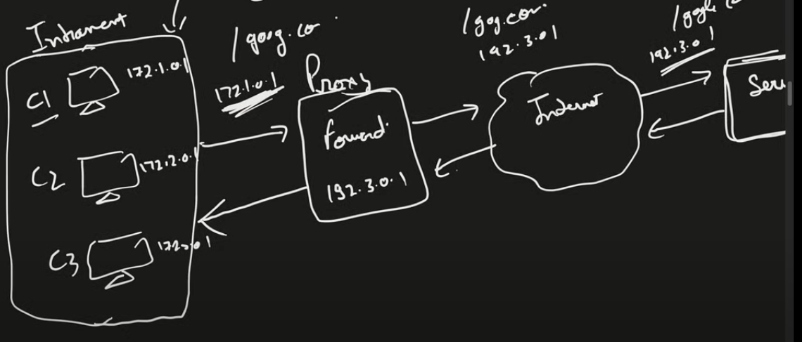

**Forward Proxy**

- Advantages
  - Forword proxy hides the client from server. i.e, it gives anonmity from outer world
  - It helps in grouping of request
  - Helps access restrictive data
  - Provide security in sense to not return response from particular sites to client. Can configure rules here
  - It can act as cache to store static content
- Disadvantages
  - It works on application level and as we know at Application layer there are many protocols like HTTP, FTP, SMTP etc.
    So for each protocol, you need a different proxy like HTTP proxy, FTP proxy to handle appropriate request

**Reverse Proxy**

- Reverse proxy hides the server from internet
- Advantages
  - Security
  - Caching/ Eg CDN : CDN not only sits between client and server, it provides the content too on server behalf.
  - Reduces latency using caching
  - It can help in load balancing

**Proxy vs VPN**

- VPN is much more than a proxy. VPN creates a tunnel from VPN client to VPN server on internet. The primary purpose of the VPN tunnel is to secure data between your device and the VPN server. This prevents eavesdroppers on your local network (like an unsecured Wi-Fi network) or your ISP from intercepting and reading your data.
  Once data is decrypted at the VPN server, it is indeed in a vulnerable state as it travels to the destination server. Now it is similar to regular internet traffic unless additional security measures are in place.
- Can carry encrypted data as well oppose to proxy which only masks IP address
  
**Proxy vs LoadBalancer**

- Reverse Proxy can act as LB but its not necessary that a KB provides proxy

**Proxy vs Firewall**

- Firewall has rules defined to scan packets and allow/restrict them from internet
- Since proxy works on application level, we can have rules defines on data as well
