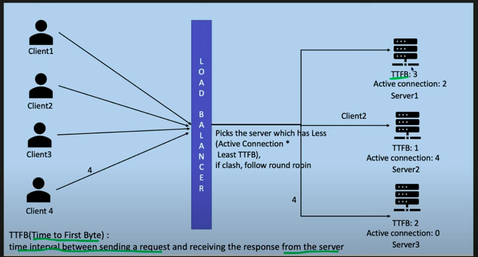

**Types**

- Application load balancer (L7 Balancer)
 : Can read and cache application layer info eg header, data, session info to route traffic

- Network load balancer (L4 Balancer)
  : Can read network layer info eg tcp/udp port, ip address to route traffic

**Load Balancer Algorithms**

- Static Load Balancing Algorithms
  - Round Robin
  - Weighted round robin
  - IP Hash
- Dynamic Load Balancing Algorithms
  - Least connection
  - Weighted least connection
  - Least response time

**Round Robin**

- Advantages: 
  - Very Easy to Implement.
  - Equal load distribution to all the servers. 
- Disadvantages:
  - One Server with high Capacity and Another with Low, both will be treated as same.
  - Chance that Low capacity Server will go down because of overload of requests.

**Weighted round robin**

- Advantages:
  - Low Capacity Server, will get saved from receiving the large no of requests.
  - Easy to implement as Weights are static, no dynamic computation.
- Disadvantages:
  - If requests have different processing time, then its possible that Low capacity server get high processing requests and get overburdened.

**IP Hash**

- Advantages:
  - Good for use cases, where Same Client need to connect to Same Server.
  - Easy to implement.
- Disadvantages:
  - If Clients request is coming through PROXY, then all the clients will have same source IP address, and this will OVERLOAD one server.
  - Can not ensure equal distribution.

**Least connection**

- Advantages:
  - Dynamic, as it consider the Load on each server, so chance of Overburdened of the server is less when each server has equal capacity.
- Disadvantages:
  - TCP connections can be ACTIVE but possible have no traffic. So purpose is failed.
  - No Difference between Low Capacity and High Capacity Server. Chance that Low capacity server will get over burdened.

**Least response time**

