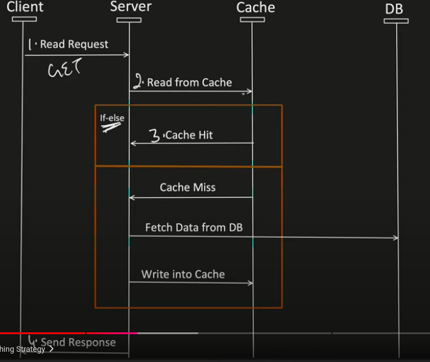
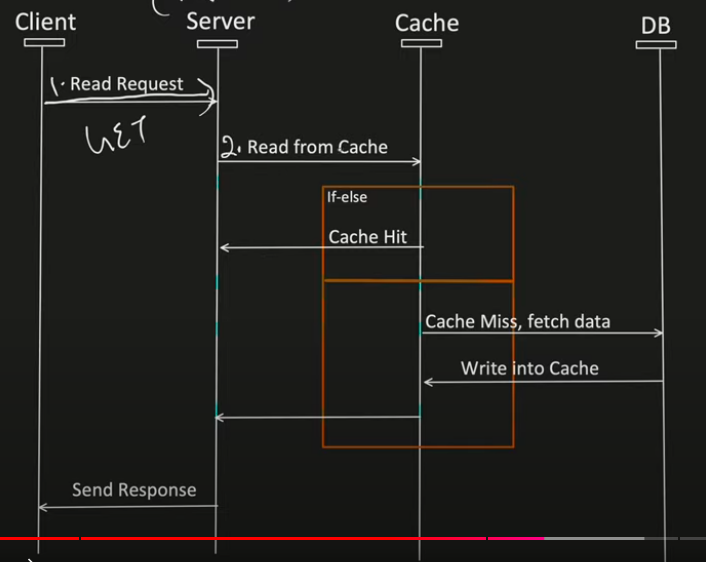
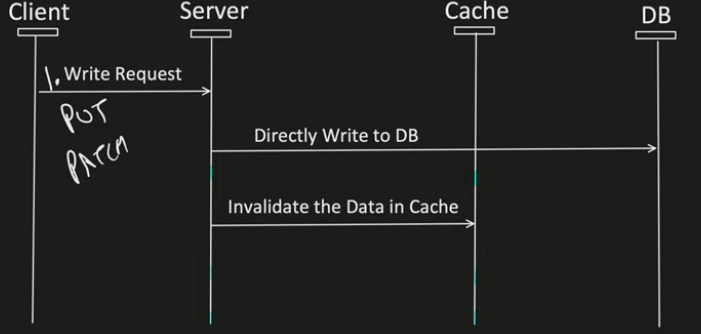
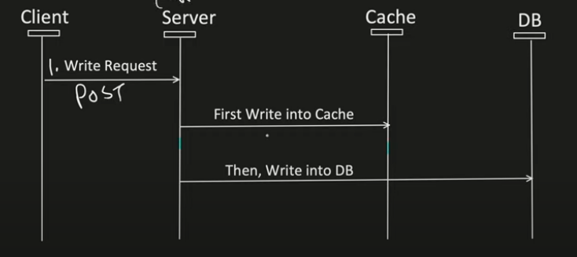
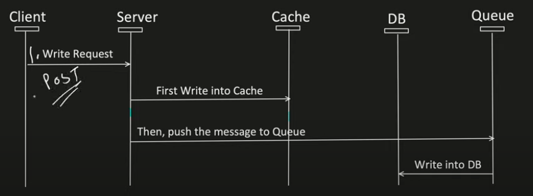

**Caching**

It is technique to store frequently used data in fast access memory so that every time data is needed, we need not to access slow access memory
There are different types of caching present at diff layers of system
- Client side caching (Browser caching)
- CDN (used to store static data)
- Load balancer
- Server side caching (like Redis etc)

**Distributed caching**

There is cache client associated with each app server which selects cache server from a pool using consistent hashing

**Cache-Aside Caching Strategy**

Data first read from cache. If present, returned immediately. If not, its fetched from DB, updates the cache and returns

- Pros
  - Good approach for Heavy Read application.
  -  Even Cache is down, request will not fail, as it will fetch the data from DB.
  - Control over what gets cached. Cache Document data structure can be different than the Data present in DB.
- Cons
  - Without appropriate caching is not used during Write operation. There is a chance of Inconsistency between Cache and DB.
  - For new data read, there will always be CACHE-MISS first. (to resolve this, generally we can pre-heat the cache).

**Read Through Caching Strategy**

Data is read from cache. If present, returned immediately. If not, its fetched from DB by the cache server itself, updated in cache and returned

- Pros
  - Good approach for Heavy Read application.
  - Logic of fetching the data from DB and updating Cache is separated from the application.
- Cons
  - For new data read, there will always be CACHE-MISS first. (to resolve this, generally we can pre-heat the cache)
  - Without appropriate caching is not used during Write operation. There is a chance of Inconsistency between Cache and DB.
  - Cache Document structure should be same as DB table.

**Write Around Caching Strategy**

Data is written to the DB. Its updated in the cache, only when read operation is performed

- Pros
  - Good approach for Heavy Read application.
  - Resolves Inconsistency problem between Cache and DB.
- Cons
  - For new data read, there will always be CACHE-MISS first. (to resolve this, generally we can pre-heat the cache)
  - If DB is down, Write operation will fail.

**Write Through Caching Strategy**

Data is written to the DB and cache in same transaction making sure Cache is always consistent with the DB

- Pros
  - Cache and DB always remain consistent.
  - Cache Hit chance increases a lot.
- Cons
  - Alone its not useful, it will increase the latency. (that's why its always used with Read through or cache aside cache)
  - 2 Phase commit, need to be supported with this. To maintain the transactional property.
  - If DB is down, write operation will fail.

**Write Back Caching Strategy**

Data is written to Cache and read from Cache. Its updated in DB asynchronously using a queue/scheduler

- Pros: 
  - Good for Write heavy application
  - Cache Hit chance increases a lot.
  - Improves the Write operation Latency. As writing into the DB happens asynchronously.
  - Gives much better performance when used with read through cache.
  - Even when DB fails, Write operation will still works.
- Cons:
  - If Data is removed from Cache and DB write still not happens, then there is a chance of an issue. (it is handled by keeping the TAT of cache little higher like 2 days)
