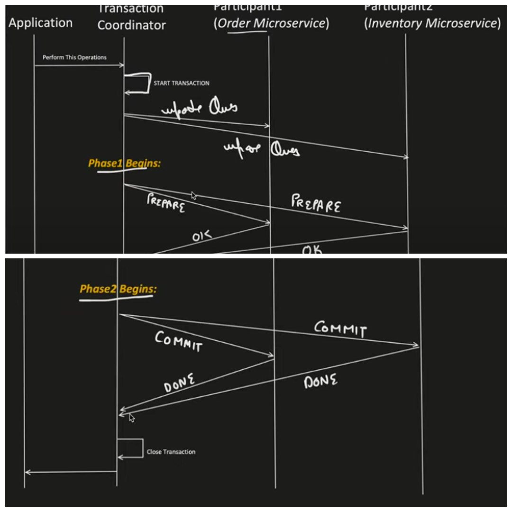
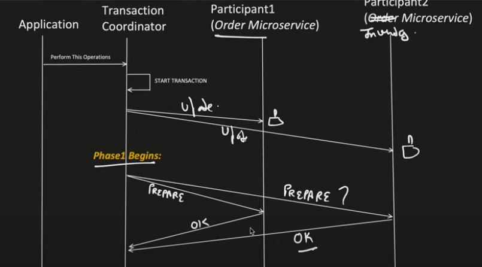
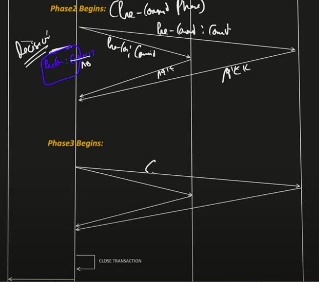

**2 Phase commit**

- Each, coordinator and participants maintain log file for every step executed
- These things are used to resolve any failure at any stage
- In prepare phase, participants can use timed waiting and abort transaction if messages are lost
- In commit phase, its totally dependent on coordinator and hence participants are in blocked state. Here timed waiting is risky, so comes 3PC
- Everything happens in synchronous manner

**3 Phase commit**

- Also, each participant can talk to another, to know their status
- These things are used to resolve any failure at any stage

**SAGA**

- Everything happens in async manner. Used when long running process

