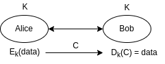
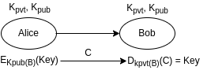
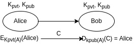

## **Cryptography and Encryption**

### **Encryption Fundamentals**

**Encryption:**
- It's a process of converting readable data into text which is difficult to understand.
- It make use of "Cryptographic key". Consider it as a mathematical value which encryption Method uses to covert the readable text into unreadable format.
- **Core Concepts**:
  - **Plaintext**: The original, readable data
  - **Ciphertext**: The encrypted, unreadable data
  - **Encryption Algorithm**: The mathematical function that converts plaintext to ciphertext
  - **Decryption Algorithm**: The mathematical function that converts ciphertext back to plaintext
  - **Key**: The secret parameter that controls the encryption and decryption process

### **Historical Context**

- **Early Encryption Methods**:
  - **Caesar Cipher**: Simple substitution cipher used in ancient Rome
  - **Enigma Machine**: Mechanical encryption device used during World War II
  - **One-Time Pad**: Theoretically unbreakable encryption method if used correctly

### **Importance of Encryption**

- **Data Protection**: Safeguards sensitive information from unauthorized access
- **Privacy**: Ensures confidential communications remain private
- **Authentication**: Verifies the identity of communicating parties
- **Integrity**: Ensures data hasn't been altered during transmission
- **Compliance**: Helps meet regulatory requirements (GDPR, HIPAA, etc.)

### **Key Properties of Strong Encryption**

- **Confidentiality**: Only authorized parties can access the information
- **Integrity**: Data cannot be altered without detection
- **Authentication**: Verifies the identity of the sender
- **Non-repudiation**: Sender cannot deny having sent the message
- **Forward Secrecy**: Compromise of current keys doesn't compromise past communications

### **Types of Encryption**

Crypto algorithms are broadly classified into two types — symmetric (e.g., AES, DES) and asymmetric (e.g., RSA, Diffie-Hellman).

#### **Symmetric Encryption**

- Symmetric Encryption
  - Same key is used for both Encryption & Decryption
  - Encryption & Decryption Algorithms:
    - DES (NOT RECOMMENDED)
      - Fixed Key length: 56 bits
      - Process data in 64 bits
      - Perform 16 rounds in its encryption process
    - AES
      - Support Key length: 128, 192 or 256 bits
      - Process data in 128 bits
      - Encryption round depends on Key size:
        - 10 rounds - 128 bits key
        - 12 rounds - 192 bits key
        - 14 rounds - 256 bits key
  - Advantages:
    - Fast and less computation compared to Asymmetric.
    - Good for Encrypting Bulk data.
  - Disadvantages:
    - Key Distribution i.e. how to securely distribute the key between client and server.
    - No. of client increases, means server has to manage those no. of Symmetric keys and its distribution too.

**How Symmetric Encryption Works**:
- Both A and B use the same key K for encryption and decryption.
- The key distribution problem of symmetric keys is solved using asymmetric algorithms.
- This type of algorithm is faster and hence can be used for larger data transfer.

**Additional Symmetric Algorithms**:
- **3DES (Triple DES)**: Applies DES three times to each data block
- **Blowfish**: Fast block cipher with variable key length (32-448 bits)
- **Twofish**: Successor to Blowfish, key sizes up to 256 bits
- **ChaCha20**: Stream cipher used in TLS and other protocols

**Operation Modes**:
- **ECB (Electronic Codebook)**: Simplest mode, each block encrypted independently
- **CBC (Cipher Block Chaining)**: Each block XORed with previous ciphertext block
- **CTR (Counter)**: Converts block cipher into stream cipher using a counter
- **GCM (Galois/Counter Mode)**: Provides both encryption and authentication

**Real-World Applications**:
- **File Encryption**: BitLocker, VeraCrypt
- **Database Encryption**: Transparent Data Encryption (TDE)
- **Communication**: TLS/SSL session encryption
- **Payment Processing**: Credit card data encryption (PCI DSS)

#### **Asymmetric Encryption**

- Asymmetric Encryption
  - Uses 2 different keys i.e. Private and Public Key.
  - Public key is used by Sender to Encrypt.
  - Private key is used by Receiver to Decrypt.
  - Encryption & Decryption Algorithms:
    - RSA
    - DSA
    - Diffie-Hellman
    - ECDHE
  - Advantages:
    - No security issues with Key Distribution. As each user has secret(private) key, which they do not forward it.
    - Provides key exchange protocols like Diffie-Hellman, ECDHE.
    - Digital Signature can be created using asymmetric encryption, help to authenticate and provide integrity too
  - Disadvantages:
    - Computation Intensive compared to symmetric encryption.
    - Might not suitable for encrypting bulk data as its little slow compare to Symmetric.

**How Asymmetric Encryption Works**:
- A set of public key (Kpub) and private key (Kpvt) are used.
- Kpub is available to both parties, A and B.
- A encrypts the data with B's Kpub and sends it to B, which can then decrypt it only with B's Kpvt.
- Kpvt is not available to all parties — only the valid party holds it.
- This type of algorithm is slower and hence restricted to smaller data transfer tasks.
- The key (K) for symmetric algorithms is shared using asymmetric algorithms.
- Such algorithms can also be used for digital signatures.

**RSA in Detail**:
- **Operation**: Based on the mathematical difficulty of factoring large prime numbers
- **Key Generation**:
  1. Choose two large prime numbers (p and q)
  2. Compute n = p × q
  3. Compute φ(n) = (p-1) × (q-1)
  4. Choose e such that 1 < e < φ(n) and gcd(e, φ(n)) = 1
  5. Compute d such that (d × e) mod φ(n) = 1
  6. Public key is (n, e), private key is (n, d)
- **Security**: Depends on key size (2048 or 4096 bits recommended)
- **Performance**: Slower than ECC for equivalent security levels

**Elliptic Curve Cryptography (ECC)**:
- **Advantage**: Smaller key sizes for equivalent security (256-bit ECC ≈ 3072-bit RSA)
- **Efficiency**: Faster computations and lower resource requirements
- **Applications**: Mobile devices, IoT, smart cards
- **Popular Curves**: NIST P-256, Curve25519, secp256k1 (used in Bitcoin)

**Real-World Applications**:
- **Secure Email**: PGP, S/MIME
- **Digital Signatures**: Code signing, document signing
- **PKI**: SSL/TLS certificates
- **Secure Key Exchange**: Initial handshake in HTTPS

### **Hybrid Encryption Systems**

Most modern cryptographic systems use a combination of symmetric and asymmetric encryption:

1. **Key Exchange**: Asymmetric encryption used to securely exchange a symmetric key
2. **Bulk Data Encryption**: Symmetric encryption used for the actual data
3. **Authentication**: Digital signatures (asymmetric) used for verification

**Examples**:
- **HTTPS/TLS**: Uses asymmetric encryption for key exchange, symmetric for session data
- **PGP/GPG**: Uses asymmetric encryption for key exchange, symmetric for message content
- **Secure Messaging Apps**: Signal Protocol combines asymmetric and symmetric techniques

### **AES (Advanced Encryption Standard)**

- it's a block cipher, means it process the data in blocks (of 128 bits)
- 
- 
- 
- 
- Each Round Consist of below steps:
  - Substitute Bytes
  - Shift Rows
  - Mix Columns
  - Add Round Key

**AES History and Selection**:
- Developed by Belgian cryptographers Joan Daemen and Vincent Rijmen
- Originally called Rijndael
- Selected by NIST in 2001 as the replacement for DES after a 5-year competition
- Became a federal standard in the United States (FIPS 197)
- Now the most widely used symmetric encryption algorithm worldwide

**Detailed Round Operations**:
- **SubBytes (Substitution)**: 
  - Each byte is replaced with another according to a lookup table (S-box)
  - Provides non-linearity and resistance to differential and linear cryptanalysis
- **ShiftRows**: 
  - Bytes in each row are shifted cyclically to the left
  - First row unchanged, second row shifted by 1, third by 2, fourth by 3
  - Creates diffusion by ensuring bytes from each column affect multiple columns
- **MixColumns**: 
  - Each column is multiplied by a fixed matrix
  - Provides diffusion by mixing the bytes within each column
  - Ensures changes in one byte affect multiple bytes
- **AddRoundKey**: 
  - Each byte is combined with the round key using XOR operation
  - Incorporates the secret key into the encryption process

**AES Security Considerations**:
- No practical attacks against full AES have been discovered
- Side-channel attacks (timing, power analysis) are the main concern
- Implementations should include countermeasures against side-channel attacks
- AES-256 is considered secure against quantum computing attacks

**AES in Practice**:
- **Hardware Acceleration**: Modern CPUs include AES-NI instructions for faster processing
- **Software Implementation**: Optimized libraries available for all major platforms
- **Performance**: Can encrypt gigabytes of data per second on modern hardware
- **Standardization**: Required for FIPS compliance and many security certifications

### **Diffie-Hellman Key Exchange**

- It's provides a way to share the secret key between SENDER and RECEIVER over insecure network
- Steps
  - Receiver and Sender decides on 
    - Prime no 7
    - Primitive root 3
  - Randon generation of private key by both sender and receiver
    - Sender private key = 4
    - Receiver private key = 5
  - Calculate Public Key : (PrimitiveRoot ^ Private) Mod Prime
    - Sender public key = 5
    - Receiver public key = 4
    - Choose Private key to be big enough so that its needs years to brute force it
  - Exchange public key
  - Calculate Shared Secret Key : (OthersPublic ^ Private) Mod Prime

**Historical Significance**:
- Invented by Whitfield Diffie and Martin Hellman in 1976
- First published method for key exchange over an insecure channel
- Revolutionary concept that helped enable modern secure communications
- Solved the key distribution problem that had plagued cryptography

**Mathematical Foundation**:
- Based on the discrete logarithm problem
- Finding the private key from the public key is computationally infeasible
- Security depends on the difficulty of the discrete logarithm problem
- The larger the prime number, the more secure the exchange

**Detailed Example with Calculations**:
1. **Setup**: 
   - Agree on prime p = 23 and generator g = 5
2. **Private Keys**:
   - Alice chooses private key a = 6
   - Bob chooses private key b = 15
3. **Public Key Calculation**:
   - Alice computes A = g^a mod p = 5^6 mod 23 = 8
   - Bob computes B = g^b mod p = 5^15 mod 23 = 19
4. **Exchange**: Alice sends 8 to Bob, Bob sends 19 to Alice
5. **Shared Secret Calculation**:
   - Alice computes s = B^a mod p = 19^6 mod 23 = 2
   - Bob computes s = A^b mod p = 8^15 mod 23 = 2
6. **Result**: Both have the same shared secret (2) without ever transmitting it

**Vulnerabilities and Mitigations**:
- **Man-in-the-Middle Attack**: An attacker can intercept and modify communications
  - Mitigation: Authenticate the public keys using digital signatures or certificates
- **Small Subgroup Attacks**: Forcing the shared secret into a small, easily guessable set
  - Mitigation: Validate public keys and use safe prime numbers
- **Computational Resources**: Modern computing power makes smaller keys vulnerable
  - Mitigation: Use sufficiently large prime numbers (2048 bits or larger)

**Modern Variants**:
- **Elliptic Curve Diffie-Hellman (ECDH)**: Uses elliptic curve cryptography for better performance
- **Authenticated Diffie-Hellman**: Adds authentication to prevent man-in-the-middle attacks
- **Perfect Forward Secrecy (PFS)**: Generates new keys for each session
- **Quantum-Resistant Variants**: Being developed to resist quantum computing attacks

**Applications**:
- **TLS/SSL**: Used in the handshake process for secure web browsing
- **IPsec**: Secures Internet Protocol communications
- **SSH**: Secure Shell protocol for remote login
- **Signal Protocol**: Used in secure messaging applications

### **Digital Signatures**

**How Digital Signature Works?**

- A signs the data with its Kpvt, which can be decrypted by anyone using A's Kpub.

**Purpose and Benefits**:
- **Authentication**: Verifies the identity of the sender
- **Integrity**: Ensures the message hasn't been altered
- **Non-repudiation**: Sender cannot deny having sent the message
- **Timestamping**: Can prove when a document was signed

**Digital Signature Process**:
1. **Creating a Signature**:
   - Generate a hash (digest) of the original message
   - Encrypt the hash with the sender's private key
   - The encrypted hash is the digital signature
   - Attach the signature to the message

2. **Verifying a Signature**:
   - Recipient receives the message and signature
   - Decrypts the signature using the sender's public key to get the original hash
   - Independently hashes the received message
   - Compares the two hashes - if they match, the signature is valid

**Common Hashing Algorithms Used**:
- **SHA-256**: Most commonly used, part of the SHA-2 family
- **SHA-3**: Newer, more secure hash function
- **BLAKE2**: Fast and secure alternative to SHA functions
- **MD5 and SHA-1**: Older algorithms now considered insecure for signatures

**Digital Signature Algorithms**:
- **RSA-PSS**: Based on RSA cryptosystem, widely supported
- **DSA (Digital Signature Algorithm)**: U.S. Federal Government standard
- **ECDSA (Elliptic Curve DSA)**: More efficient than RSA or DSA
- **EdDSA (Edwards-curve DSA)**: Modern algorithm with high security and performance

**Real-World Applications**:
- **Code Signing**: Verifies the authenticity of software
- **Document Signing**: Legal contracts, agreements, forms
- **Email Signing**: Authenticates email sender (S/MIME, PGP)
- **Blockchain**: Transaction validation in cryptocurrencies
- **SSL/TLS Certificates**: Website authentication

**Legal Status**:
- Digital signatures are legally binding in many countries
- Laws like the ESIGN Act (US) and eIDAS Regulation (EU) establish their legal validity
- Qualified digital signatures in the EU have the equivalent legal effect of handwritten signatures

**Security Considerations**:
- **Private Key Protection**: Must be securely stored, often using hardware security modules
- **Certificate Expiration**: Digital certificates have limited validity periods
- **Revocation**: Mechanisms needed to invalidate compromised keys
- **Quantum Computing Threat**: Current algorithms may be vulnerable to future quantum computers

**Advanced Concepts**:
- **Blind Signatures**: Allow signing a message without seeing its content (used in e-voting)
- **Group Signatures**: Allow a member of a group to sign anonymously on behalf of the group
- **Threshold Signatures**: Require multiple parties to collaborate to create a signature

### **Post-Quantum Cryptography (PQC)**

- PQC : Post Quantum Cryptography
  - It is said that symmetric algos performance will be decreased by 50% during post quantum era, so for its security we can use 256 bit key in post quantum era where 128 is required now.
  - The protocols like ipsec, Tls etc uses encryption internally which needs to be replaced with pqc algos for future
  - The classical algos will not be able to provide security in post quantum era and hence these requirement for security will be meet by pqc algos
  - NIST is the authority who is involved in the standardization of pqc algos.
