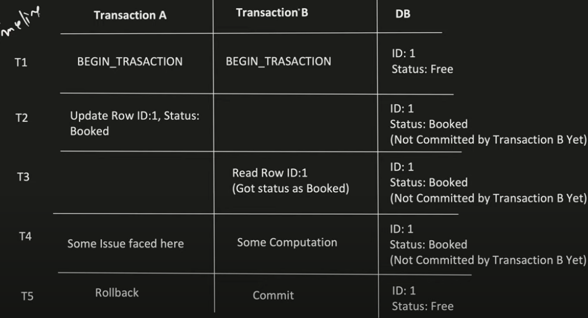
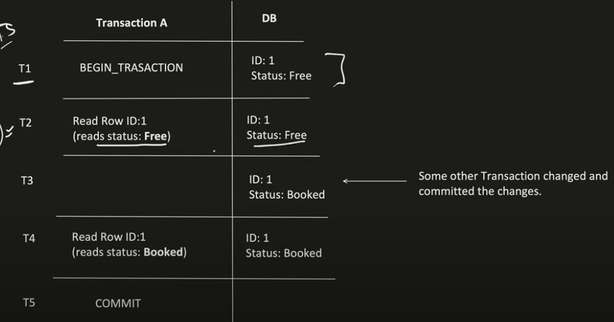
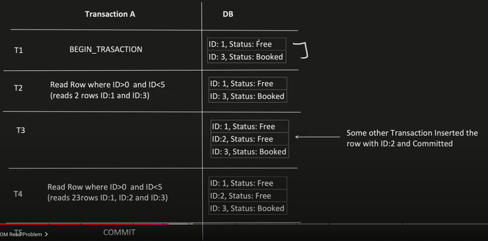
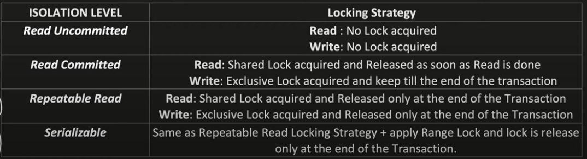
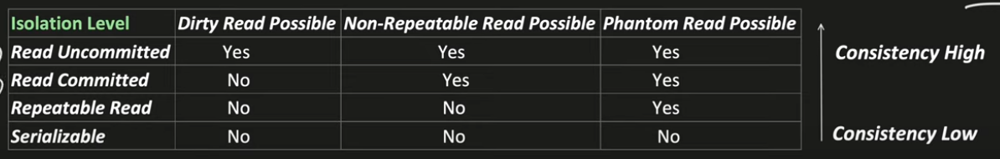
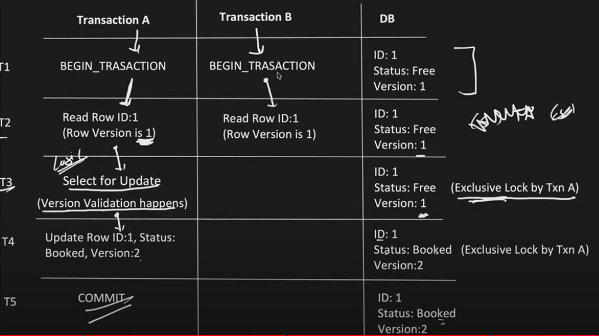

Synchronised (critical section) will not work in Distributed system scenario, where comes use of Distributed concurrency control

- What is the usage of Transaction?
  - Transaction helps to achieve INTEGRITY. Means it help us to avoid INCONSISTENCY in our database.
  
- What is DB Locking?
  - DB Locking, help us to make sure that no other transaction update the locked rows.
  - Shared locks are also known as read locks 
    

- Dirty Read:
  - If Transaction A is reading the data which is writing by Transaction B and not yet even committed. If Transaction B does the rollback, then whatever data read by Transaction A is know dirty read.
  
- Non-Repeatable Read :
  - If suppose Transaction A, reads the same row several times and there is a chance that it reads different value.
  
- Phantom Read : 
  - If suppose Transaction A, executes same query several times and there is a chance that the rows returned are different.
  
- What are the Isolation Level present?
    
- Read uncommited to be used only for read heavy
  

- Optimistic concurrency control
  - Version column is used to acheive this
  - Isolation Level used Below REPEATABLE READ (read commited)
  - Much Higher Concurrency
  - No chance of Deadlock
  - In case of conflict, overhead of transaction rollback and retry logic is there.
  
  
- Pessimistic concurrency control
  - Isolation Level used REPEATABLE READ and SERIALIZABLE
  - Less Concurrency compared to Optimistic.
  - Deadlock is Possible, then transactions stuck in deadlock are forced to do rollback.
  - Putting a long lock, sometimes timeout issue comes and rollback need to be done.
  

