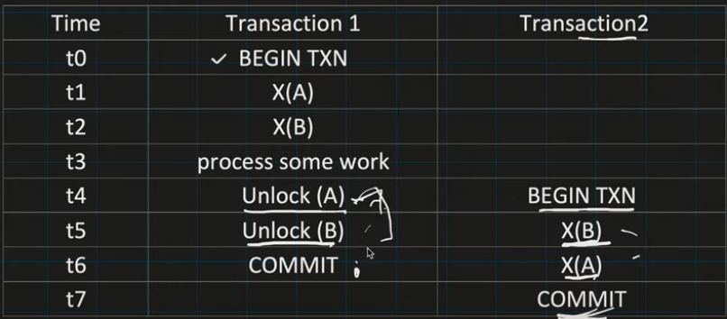
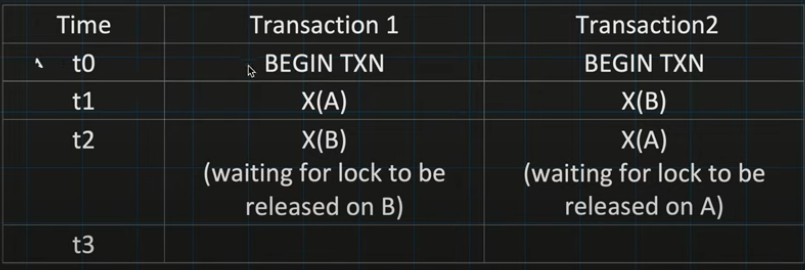
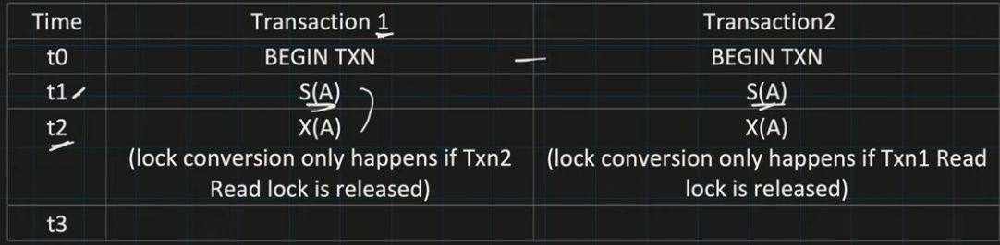
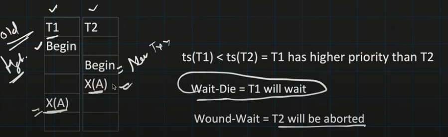
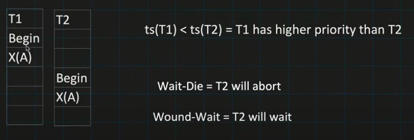

**Basic Two Phase Locking:**

- Phase1: Growing Phase
  - Txn request for the lock by Lock manager.
  - Lock Manager either grant or denied the lock request (denied if other txn has placed the locked on it already)
- Phase2: Shrinking Phase
  - Txn can not acquire any new locks.
  - Txn is only allowed to release the lock which is taken previously.

**2 big issues with basic 2PL and its work around**
- Deadlock
- Cascading Aborts

**Deadlock**

**Deadlock Prevention Strategies:**

- Timeout:
  - In this strategy, scheduler find out that TXN is waiting too long for the lock, it simply assumes that there might be a deadlock involving this transaction and thus abort it. 
  - Schedule can make mistake (what if TXN1 wait for the lock, which is acquired by other TXN2 which is taking just long time to finish).

- Direct graph called Wait-for-Graph(WFG):
  - There will be an edge from node Ti to Tj.
  - Scheduler delete the edge, whenever lock is release by particular txn which causing some other txn to wait. 
  - Scheduler looks for cycle in the WFG and try to identify the deadlock. 
  - When deadlock is identified, TXN is chosen from the cycle in WFG that need to be ABORTED (these txns are called victim)
  - Scheduler check below things to identify the victim:
    - The amount of effort txn has put till now
    - The amount of effort required to finish the txn
    - The cost of Aborting the txn (cost generally means here is how many updates already has been done)
    - The number of cycles that contains the transaction.
      
- Conservative 2PL (also know as Static 2PL): 
  - Avoid deadlock by requiring each txn to aquire all the locks at start of the txn itself.
  - Each txn, predaclared its Read and Write operation to the scheduler.
  - Scheduler tries to set all the lock needed by txn.
  - If Scheulder fails to acquire any lock, none of the lock will be granted to Txn and it will wait.
  - Cons of Conservative 2PL:
     - Less concurrency
     - Extra overhead for Scheduler to know all the Read and Write operation of txn before starting the operation.

- TimeStamp based Deadlock detection:
  - Old TimeStamp of Txn = High Priority of the Txn
  - Wait-Die:
     - Old txn waits for the New txn
     - ts(T1) < ts(T2), then T1 will wait for T2 to get completed, otherwiase txn will get aborted.
  - Wound-Wait:
     - Old txn give wound to the new txn and make them aborted
     - ts(T1) < ts(T2), then T2 abort and releases its lock otherwise txn will wait.
      
      

**Cascading Aborts Prevention Strategy:**

- Strong Strict 2PL (also know as Rigorous 2PL):
  - Txn is not allowed to acquire or upgrade more lock after growing phase.
  - Release all the locks at the end of the txn only.
  - Cons of strict 2PL
    - Less concurrency
    - Deadlock
