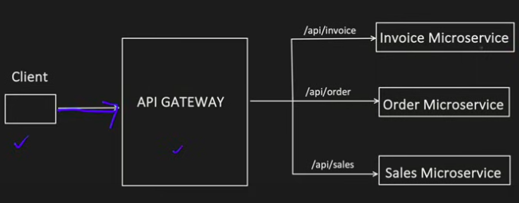
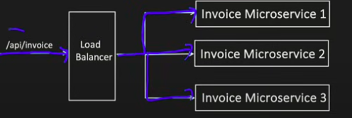
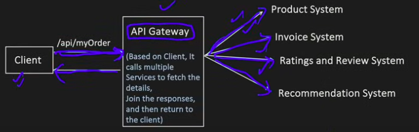
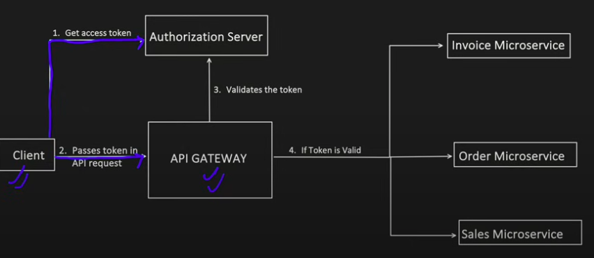
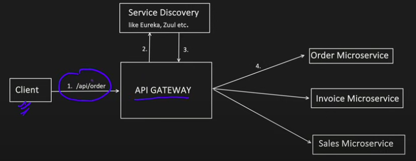
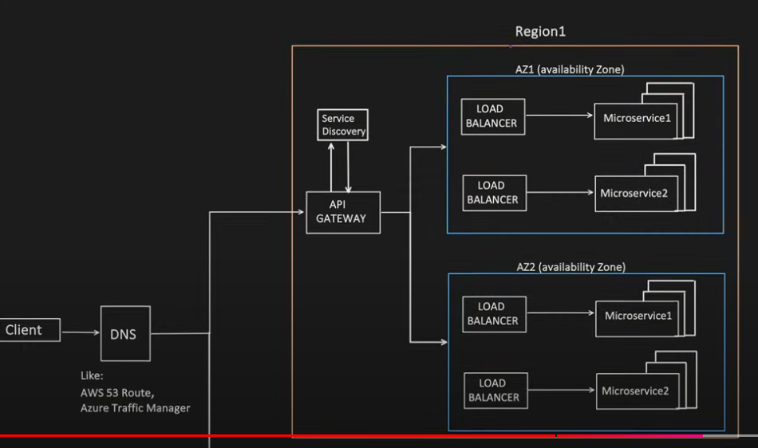
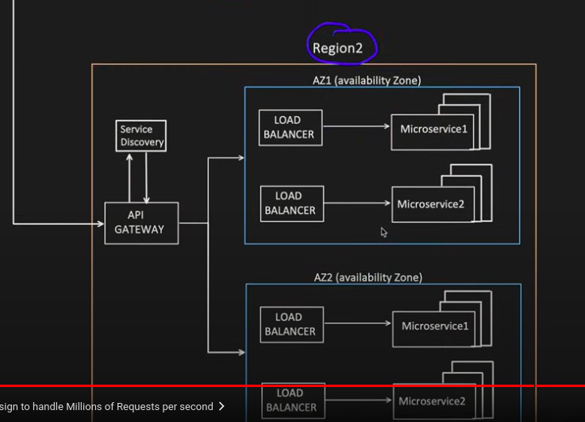

## **API Gateway**

### **What is API GATEWAY?**

- In simple term, It accepts the client API request and route them to correct backend service based on API endpoint.
- **Formal Definition**: An API Gateway is a server that acts as an intermediary between clients and a collection of backend services, providing a unified entry point for external consumers.
- **Core Responsibilities**: 
  - Request routing to appropriate microservices
  - Protocol translation (e.g., REST to gRPC)
  - Aggregation of multiple service responses
  - Implementing cross-cutting concerns (security, monitoring)

### **Evolution and Need for API Gateways**

- **Monolithic to Microservices Transition**: As applications moved from monoliths to microservices, the need for a centralized entry point emerged
- **Client Complexity Reduction**: Without an API Gateway, clients would need to know about and connect to multiple services directly
- **Cross-Cutting Concerns**: Common functionality like authentication and monitoring needed to be implemented consistently across services
- **Backend Encapsulation**: API Gateways hide the internal structure of the application, allowing backend services to evolve independently

### **Types of API Gateways**

1. **Edge Gateway**: Handles external traffic entering the system, focusing on security and traffic management
2. **Internal Gateway**: Routes traffic between internal services, often with different policies than edge gateways
3. **Specialized Gateways**:
   - **Mobile Backend Gateway**: Optimized for mobile client needs
   - **IoT Gateway**: Handles the unique requirements of IoT devices
   - **Partner API Gateway**: Manages access for business partners with specific SLAs

### **How API GATEWAY is different from Load Balancer? Does It comes before or after the load balancer?**

- Generally Load Balancer simply distribute the traffic to the multiple instances of a microservice based on various factors like health, traffic load etc.
- But usually they don't have capability to understand an API and then take decision, where to route it.

#### **Detailed Comparison**

| Feature | API Gateway | Load Balancer |
|---------|-------------|---------------|
| **Primary Purpose** | Routing requests to appropriate services based on business logic | Distributing traffic across multiple instances of the same service |
| **Protocol Awareness** | Application layer (L7) - understands HTTP, headers, paths | Often works at transport layer (L4) - TCP/UDP, though L7 load balancers exist |
| **Functionality** | Rich feature set (auth, transformation, composition) | Focused on distribution and availability |
| **Service Awareness** | Understands different services and their APIs | Typically unaware of service differences |
| **Configuration Complexity** | More complex, requires API definitions | Simpler, focused on health and distribution rules |

#### **Typical Deployment Patterns**

1. **API Gateway Before Load Balancer**:
   - Client → API Gateway → Load Balancer → Service Instances
   - Advantages: Gateway can make routing decisions before load balancing
   - Use case: When gateway needs to route to different services

2. **Load Balancer Before API Gateway**:
   - Client → Load Balancer → API Gateway Instances → Services
   - Advantages: Can scale gateway instances horizontally
   - Use case: High-volume APIs requiring multiple gateway instances

3. **Hybrid Approach**:
   - Client → Edge Load Balancer → API Gateway → Internal Load Balancers → Services
   - Advantages: Combines benefits of both approaches
   - Use case: Large-scale production environments

### **Core Capabilities of API Gateways**

- Apart from ROUTING, other Capabilities of API Gateways are:

#### **1. API Composition**
  - It may be required to hit different type/no of apis for different clients.
  - API Gateway, can make life of Client easier through API Composition functionality
  - 
  - **Implementation Approaches**:
    - **Aggregation**: Combining results from multiple backend services into a single response
    - **Chaining**: Using the output of one service call as input to another
    - **Splitting**: Dividing a single client request into multiple backend requests
  - **Benefits**:
    - Reduces network overhead for clients
    - Simplifies client implementation
    - Enables backend refactoring without client changes
  - **Challenges**:
    - Increased response time due to sequential calls
    - Error handling complexity when partial failures occur
    - Potential performance bottlenecks

#### **2. Authentication & Authorization**
  - Only one time authorization call is required and it can be serve to call multiple apis
  - 
  - **Common Authentication Methods**:
    - **API Keys**: Simple tokens included in requests
    - **OAuth 2.0/OpenID Connect**: Industry standard for delegated authorization
    - **JWT**: Compact, self-contained tokens for information transfer
    - **mTLS**: Certificate-based mutual authentication
  - **Authorization Capabilities**:
    - Role-based access control (RBAC)
    - Attribute-based access control (ABAC)
    - Scope-based permissions
    - Fine-grained resource access policies
  - **Security Benefits**:
    - Centralized security enforcement
    - Consistent policy application
    - Reduced attack surface for backend services
    - Simplified audit and compliance

#### **3. Rate Limiting & Traffic Management**
  - Manage Burst limit:
    - Use to limit the Burst traffic, means max no. of concurrent request that API Gateway can handle before it return 429 (Too Many Requests).
  - API Throttling:
    - Limiting the number of requests from an individual or an application by temp blocking the request, once they crossed the allowed request rate.
  - Ip based blocking
  - API Queues:
    - Hold requests to an API, which can not be processed immediately. It helps to handle the Thundering herd issue.
  - **Rate Limiting Algorithms**:
    - **Token Bucket**: Allows bursts up to a certain size
    - **Leaky Bucket**: Processes requests at a constant rate
    - **Fixed Window**: Limits requests in fixed time intervals
    - **Sliding Window**: More granular control over request distribution
  - **Advanced Traffic Management**:
    - **Circuit Breaking**: Preventing cascading failures
    - **Retry Policies**: Intelligent handling of transient failures
    - **Timeout Management**: Preventing long-running requests
    - **Traffic Shadowing**: Duplicating traffic for testing

#### **4. Service Discovery**
  - As microservices can scale up and down, its necessary to know the location (IP address and Port). Service Discovery keep tracks those.
    - Approach 1: Each Microservice register or de-register themselves.
    - Approach 2: Service Discovery, keeps health check of all the registered microservices and keep only active microservices location.
  - 
  - **Service Discovery Patterns**:
    - **Client-side Discovery**: Clients query a service registry and make direct connections
    - **Server-side Discovery**: Gateway queries registry and routes requests appropriately
    - **DNS-based Discovery**: Using DNS for service location
  - **Popular Service Discovery Tools**:
    - **Consul**: Service mesh with built-in service discovery
    - **etcd**: Distributed key-value store used for service discovery
    - **Eureka**: Netflix's service discovery solution
    - **Kubernetes Service Discovery**: Native discovery in Kubernetes environments

#### **5. Additional Capabilities**
  - **Request-Response Transformation**:
    - Protocol translation (REST/SOAP/gRPC)
    - Payload format conversion (XML/JSON/Protobuf)
    - Header manipulation and normalization
    - Field filtering and masking sensitive data

  - **Response Caching**:
    - Reduces backend load for frequently requested data
    - Improves response times for clients
    - Configurable cache policies per endpoint
    - Cache invalidation strategies

  - **Monitoring & Logging**:
    - Centralized API metrics collection
    - Request/response logging
    - Latency tracking and performance monitoring
    - Error rate and availability statistics
    - Integration with observability platforms

  - **Versioning & Lifecycle Management**:
    - API versioning strategies
    - Deprecation management
    - Backward compatibility support
    - Canary releases and A/B testing

### **Scaling API Gateways for High Traffic**

#### **If API GATEWAY a Single entry point, how does it handle millions of requests per second?**

- **Horizontal Scaling Strategies**:
  - Deploying multiple gateway instances behind a load balancer
  - Stateless design to enable easy scaling
  - Geographic distribution for global applications
  - Auto-scaling based on traffic patterns

- **Performance Optimization Techniques**:
  - Efficient routing algorithms
  - Connection pooling to backend services
  - Asynchronous processing for non-blocking operations
  - Hardware acceleration for cryptographic operations
  - Response caching for frequently accessed data

- **High Availability Configurations**:
  - Multi-zone and multi-region deployments
  - Active-active configurations
  - Automated failover mechanisms
  - Health checking and self-healing capabilities

#### **Is then DNS is a single point of failure?**
- No, there are multiple hierarchy of DNS:
  - Local DNS 
  - Root DNS
  - Top Level DNS
  - Authoritative DNS etc
- So that's also distributed and not a single point of failure
- Like Amazon AWS 53 route Authoritative DNS does more than just resolving domain name, it also act like load balancer which distribute the traffic to API Gateways

- **DNS Resilience Mechanisms**:
  - Redundant DNS servers
  - Anycast routing for DNS services
  - TTL (Time-to-Live) optimization
  - EDNS Client Subnet for improved routing accuracy
  - DNS-based global load balancing

### **Popular API Gateway Implementations**

#### **Commercial Solutions**:
- **Amazon API Gateway**: Fully managed service for creating, publishing, and securing APIs
- **Azure API Management**: Hybrid, multi-cloud management platform for APIs
- **Google Cloud Apigee**: Full lifecycle API management platform
- **Kong Enterprise**: API platform built on top of the open-source Kong Gateway
- **MuleSoft Anypoint Platform**: Integration platform with API management capabilities

#### **Open Source Options**:
- **Kong Gateway**: Kubernetes-native API gateway built on NGINX
- **Tyk**: Open source API gateway written in Go
- **KrakenD**: Ultra-high performance API gateway with no dependencies
- **Express Gateway**: API Gateway built on Express.js
- **APISIX**: Cloud-native API gateway with dynamic routing and plugins

#### **Cloud-Native Solutions**:
- **Istio Gateway**: Part of the Istio service mesh, focused on ingress traffic
- **Ambassador**: Kubernetes-native API gateway built on Envoy
- **Gloo**: API gateway built on Envoy Proxy with focus on function-level routing
- **Traefik**: Modern HTTP reverse proxy and load balancer

### **Best Practices for API Gateway Implementation**

1. **Design Considerations**:
   - Define clear API boundaries and responsibilities
   - Establish consistent naming conventions and patterns
   - Design for backward compatibility
   - Consider API versioning strategy from the start

2. **Security Best Practices**:
   - Implement defense in depth (multiple security layers)
   - Use TLS for all communications
   - Apply principle of least privilege for access control
   - Regularly audit and update security policies
   - Implement robust authentication and authorization

3. **Performance Optimization**:
   - Monitor and optimize gateway performance
   - Implement appropriate caching strategies
   - Consider request batching for chatty APIs
   - Use compression for large payloads
   - Implement circuit breakers for failing services

4. **Operational Excellence**:
   - Implement comprehensive monitoring and alerting
   - Establish clear deployment and rollback procedures
   - Document APIs thoroughly
   - Implement proper testing strategies (unit, integration, performance)
   - Plan for disaster recovery scenarios
