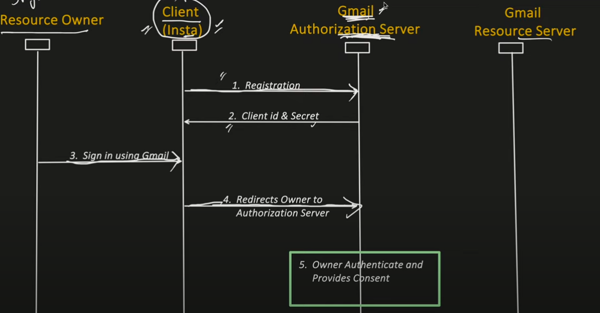
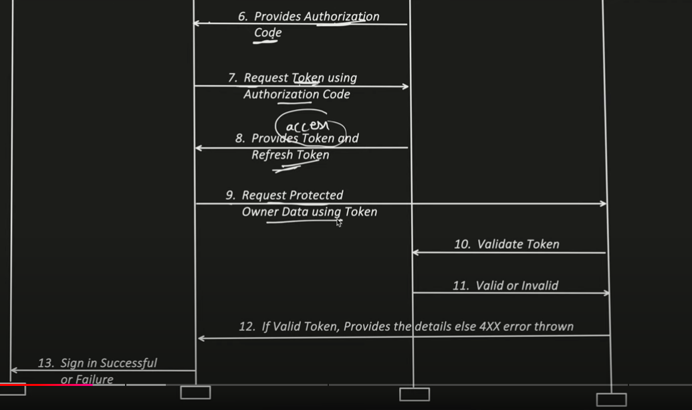

**Open Authorization**\

- Why its used?
  - It's a Authorization framework.
  - Enables secure third-party access to user protected data.
- Four imp actors/roles involved in it
  - Resource owner
  - Client 
  - Authorization server
  - Resource hosting server
- Authorization Grant Types : Mechanism used by client to obtain Access Token
  - Authorization Code Grant
  - Implicit Grant
  - Resource Owner Password Credentials Grant
  - Client Credential Grant
  - Refresh Token Grant

**Authorization Code Grant**

- Bearer: is a security mechanism, and it means that client should add the TOKEN in the authorization header, whenever it want to access the protected resources.
- Token Value: it can either be JWT token or plain string.
- Expiry Time: generally its in seconds. After expiry Refresh token should be used to get new Tokens.

**Refresh Token Grant**

- Used to new access token

**Implicit Grant**

- No 2 step process to get access token
- No refresh token returned in this

**Resource Owner Password Credentials Grant**

- Here grant_type is password
- There is no separate Authorization call in ROPC Grant
- Username and Password is not required during refresh token usage

**Client Credential Grant**

- Used when resource owner is same as cliet
- There is no Refresh token required in this.
- There is no Authorization call too.
