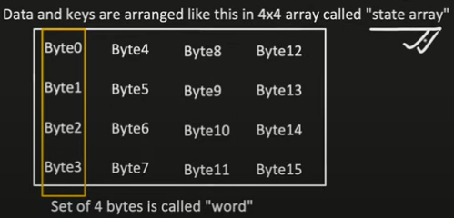
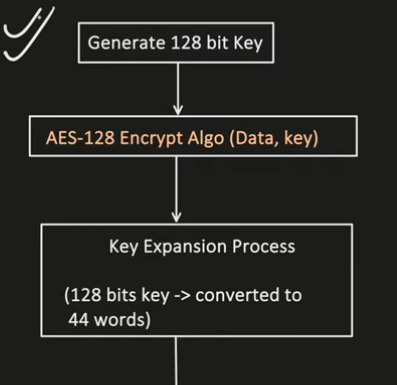
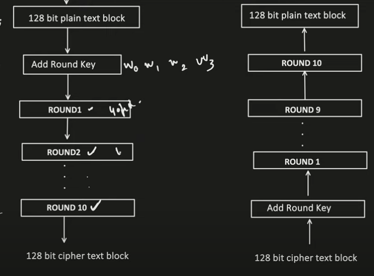
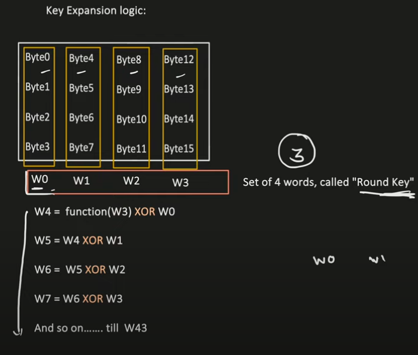
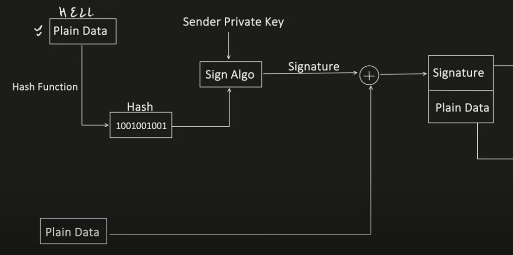
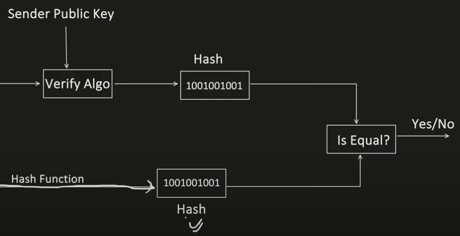

**Encryption:**
- It's a process of converting readable data into text which is difficult to understand.
- It make use of "Cryptographic key". Consider it as a mathematical value which encryption Method uses to covert the readable text into unreadable format.

**Types**

- Symmetric Encryption
  - Same key is used for both Encryption & Decryption
  - Encryption & Decryption Algorithms:
    - DES (NOT RECOMMENDED)
      - Fixed Key length: 56 bits
      - Process data in 64 bits
      - Perform 16 rounds in its encryption process
    - AES
      - Support Key length: 128, 192 or 256 bits
      - Process data in 128 bits
      - Encryption round depends on Key size:
        - 10 rounds - 128 bits key
        - 12 rounds - 192 bits key
        - 14 rounds - 256 bits key
  - Advantages:
    - Fast and less computation compared to Asymmetric.
    - Good for Encrypting Bulk data.
  - Disadvantages:
    - Key Distribution i.e. how to securely distribute the key between client and server.
    - No. of client increases, means server has to manage those no. of Symmetric keys and its distribution too.
- Asymmetric Encryption
  - Uses 2 different keys i.e. Private and Public Key.
  - Public key is used by Sender to Encrypt.
  - Private key is used by Receiver to Decrypt.
  - Encryption & Decryption Algorithms:
    - RSA
    - DSA
    - Diffie-Hellman
    - ECDHE
  - Advantages:
    - No security issues with Key Distribution. As each user has secret(private) key, which they do not forward it.
    - Provides key exchange protocols like Diffie-Hellman, ECDHE.
    - Digital Signature can be created using asymmetric encryption, help to authenticate and provide integrity too
  - Disadvantages:
    - Computation Intensive compared to symmetric encryption.
    - Might not suitable for encrypting bulk data as its little slow compare to Symmetric.

**AES(Advanced Encryption Standard)**

- it's a block cipher, means it process the data in blocks (of 128 bits)
- 
- 
- 
- 
- Each Round Consist of below steps:
  - Substitute Bytes
  - Shift Rows
  - Mix Columns
  - Add Round Key

**Diffie-Hellman**

- It's provides a way to share the secret key between SENDER and RECEIVER over insecure network
- Steps
  - Receiver and Sender decides on 
    - Prime no 7
    - Primitive root 3
  - Randon generation of private key by both sender and receiver
    - Sender private key = 4
    - Receiver private key = 5
  - Calculate Public Key : (PrimitiveRoot ^ Private) Mod Prime
    - Sender public key = 5
    - Receiver public key = 4
    - Choose Private key to be big enough so that its needs years to brute force it
  - Exchange public key
  - Calculate Shared Secret Key : (OthersPublic ^ Private) Mod Prime

**How Digital Signature Works?**

