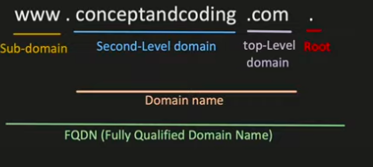
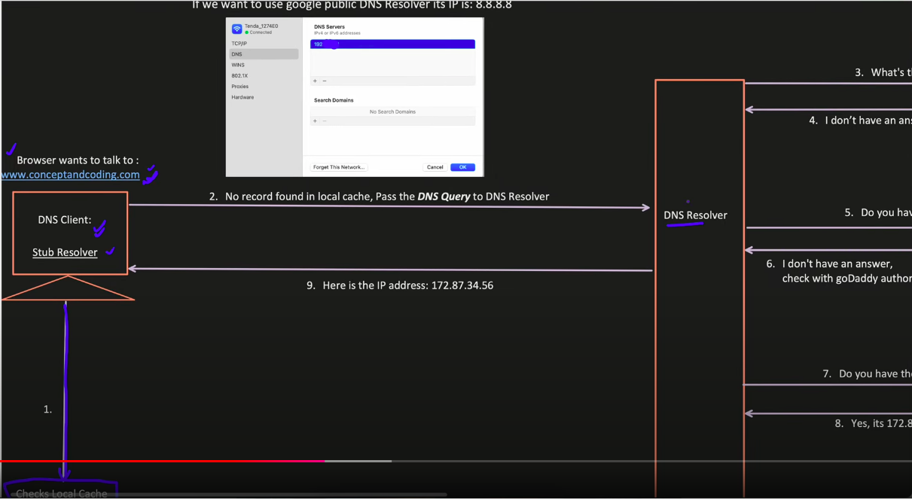
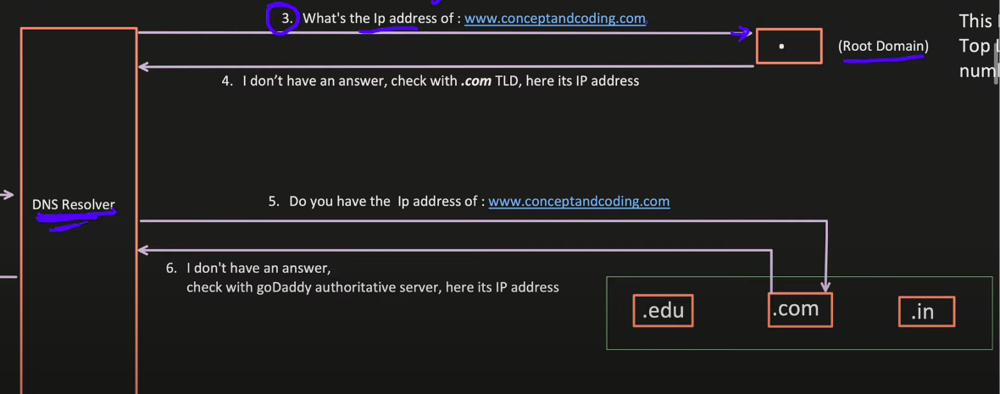
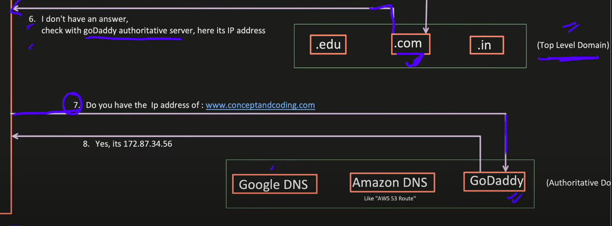
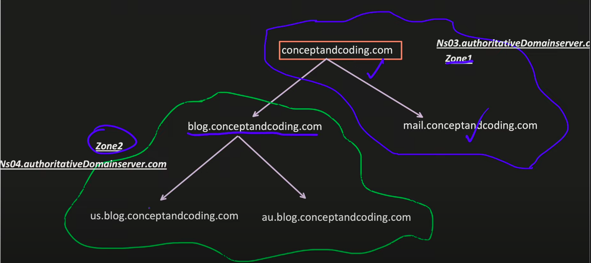
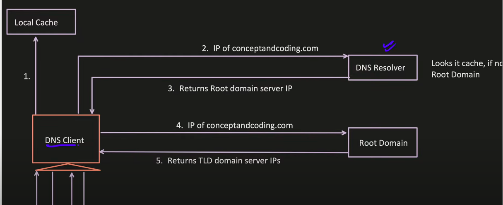
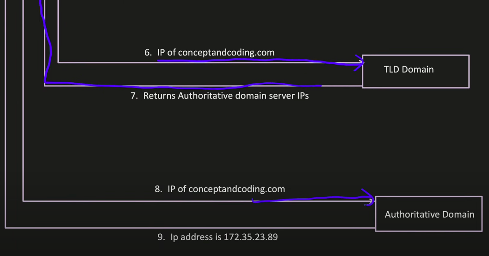

## **Domain Name System (DNS)**

### **Introduction to DNS**

The Domain Name System (DNS) is a hierarchical and decentralized naming system for computers, services, or other resources connected to the Internet. It translates human-readable domain names into machine-readable IP addresses, enabling users to access websites using easy-to-remember names instead of numerical IP addresses.

DNS serves as the "phone book" of the Internet, maintaining a distributed directory of domain names and translating them to IP addresses. This critical infrastructure enables nearly all Internet services and applications to function properly.

### **What is Ip Address?**
- IP Address, is a unique numerical label assigned to each server or device connected to internet.
- In simple terms, it helps one device to locate another device on the internet.

**What is Domain Name?**
- Its a human readable/friendly address used to identify a server or device on the internet.
- Like: google.com, amazon.com etc

**DNS:**
- DNS helps to translates domain name into IP Addresses.
- But How? 
  - There are 2 approaches:
    - Recursive
    - Iterative

**Recursive**

- When we type address in browser, first it checks in local cache maintained at OS level
  - In terminal, we can check the list of DNS which are cached by DNS Client using: ipconfig/displaydns
  - One DNS Record has below main information:
    - Record Name: contains domain name or sub-domain name
    - CNAME Record:
      - Canonical Name, is used to ALIAS one domain to another (subdomain only)
      - example: www.conceptandcoding.com and blog.conceptandcoding.com is an alias of conceptandcoding.com
    - A (Host) Record: Address record maps a record name to an IP Address.
  
- If not found in local cache, then it search that in DNS Resolver
  - DNS resolver IP is provided by ISP or we can also use our custom DNS IP
  - If we want to use google public DNS Resolver its IP is: 8.8.8.8
- DNS Resolver will use the nearest root server out of 13 available root servers
  - All over the world, there are 13 root servers. We can check the Root servers list at: IANA (Internet Assigned Number Authority)
  - Each DNS Resolver hold this information.
    - A-root: Operated by Verisign, Inc.
      - Record Name: a.root-servers.net
    - B-root: Operated by U.S.C. Information Sciences Institute.
      - Record name: b.root-servers.net
    - etc
- This Root domain, hold the DNS record for each Top Level Domain (there are 1000+ TLD and number keep on changing)
  

- TLD (Top Level domain) maintains the DNS record for authoritative name servers (ANS) and forward it to respective ANS address

**How TLD, knows that 'conceptandcoding.com' belongs to 'GoDaddy' authoritative server?**

- When user apply for any domain like 'conceptandcoding.com' GoDaddy (Registrar) communicate with respective TLD registry.
- .com Registry (Verisign maintained it) receives the request + the name servers of the GoDaddy which will be used to resolve the domain request for 'conceptandcoding.com'

**What is DNS Zone**

- Consider it as a separate area, which helps to provide more granular control over that.
- It also helps to offload the responsibility from the single authoritative domain server.
- For example: 
  - conceptandcoding.com
  - mail.conceptandcoding.com
  - blog.conceptandcoding.com
  - admin.conceptandcoding.com
  - cdn.image.media conceptandcoding.com
  - systemdesign.resource.conceptandcoding.com etc
- If zone is not there, only 1 authoritative server, which hold the DNS record (Record Name, Ip Address, TTL etc..) query for all the subdomains.
- But we can distribute the load, by creating more authoritative domain servers, just see how load is distributed between TLD server: authoritative level, instead of putting load on 1 server, we can distributed the traffic

**Iterative**

- Here DNS Client is responsible for calls to resolve address

### **DNS Record Types**

DNS records are instructions that live in authoritative DNS servers and provide information about a domain including what IP address is associated with that domain and how to handle requests for that domain. These records consist of a series of text files written in what is known as DNS syntax. Here are the most common types:

#### **A Record (Address Record)**
- Maps a domain name to an IPv4 address
- Example: `example.com. IN A 192.0.2.1`
- Used for: Basic domain-to-IP mapping for websites and services

#### **AAAA Record (IPv6 Address Record)**
- Maps a domain name to an IPv6 address
- Example: `example.com. IN AAAA 2001:0db8:85a3:0000:0000:8a2e:0370:7334`
- Used for: IPv6-enabled services

#### **CNAME Record (Canonical Name)**
- Creates an alias from one domain name to another
- Example: `www.example.com. IN CNAME example.com.`
- Used for: Subdomains pointing to the same IP as the main domain

#### **MX Record (Mail Exchange)**
- Specifies mail servers responsible for receiving email
- Includes priority values (lower numbers = higher priority)
- Example: `example.com. IN MX 10 mail.example.com.`
- Used for: Email routing

#### **TXT Record (Text)**
- Holds arbitrary text information
- Example: `example.com. IN TXT "v=spf1 include:_spf.example.com ~all"`
- Used for: Domain verification, SPF, DKIM, and other security protocols

#### **NS Record (Name Server)**
- Delegates a DNS zone to a specific authoritative name server
- Example: `example.com. IN NS ns1.example.com.`
- Used for: DNS delegation and zone management

#### **SOA Record (Start of Authority)**
- Contains administrative information about the DNS zone
- Includes serial number, refresh intervals, retry intervals, expiry time, and minimum TTL
- Example: `example.com. IN SOA ns1.example.com. admin.example.com. (
  2023042201 ; Serial
  3600       ; Refresh (1 hour)
  1800       ; Retry (30 minutes)
  604800     ; Expire (1 week)
  86400      ; Minimum TTL (24 hours)
)`
- Used for: Zone transfers and caching control

#### **PTR Record (Pointer)**
- Maps an IP address to a domain name (reverse DNS lookup)
- Example: `1.2.0.192.in-addr.arpa. IN PTR example.com.`
- Used for: Reverse DNS lookups, often for email validation

#### **SRV Record (Service)**
- Specifies location of servers for specific services
- Example: `_sip._tcp.example.com. IN SRV 10 60 5060 sipserver.example.com.`
- Used for: VoIP, XMPP, and other service discovery

#### **CAA Record (Certification Authority Authorization)**
- Specifies which certificate authorities can issue certificates for a domain
- Example: `example.com. IN CAA 0 issue "letsencrypt.org"`
- Used for: SSL/TLS certificate issuance control

### **DNS Caching and TTL**

DNS caching is a temporary storage of DNS records to reduce DNS lookup times and decrease network traffic.

#### **How DNS Caching Works**
- When a DNS resolver receives a response, it stores (caches) that information
- Subsequent queries for the same domain use the cached information
- Caching occurs at multiple levels:
  - Browser cache
  - Operating system cache
  - ISP resolver cache
  - Recursive DNS server cache

#### **Time To Live (TTL)**
- TTL is a value (in seconds) that determines how long a DNS record should be cached
- Lower TTL values:
  - Allow faster propagation of DNS changes
  - Increase DNS query traffic
  - Useful during migrations or changes
- Higher TTL values:
  - Reduce DNS query traffic
  - Improve performance
  - Slower propagation of changes
- Typical TTL values range from 300 seconds (5 minutes) to 86400 seconds (24 hours)
- Example TTL setting: `example.com. 3600 IN A 192.0.2.1`

#### **Negative Caching**
- Caching of negative responses (domain doesn't exist, record not found)
- Helps reduce repeated queries for non-existent domains
- Controlled by the SOA record's minimum TTL field

### **DNS Security**

#### **DNSSEC (DNS Security Extensions)**
- Adds cryptographic signatures to DNS records
- Allows verification that DNS responses haven't been tampered with
- Protects against DNS cache poisoning and spoofing attacks
- Components:
  - Zone signing keys (ZSK)
  - Key signing keys (KSK)
  - DS (Delegation Signer) records
  - RRSIG (Resource Record Signature) records
- Implementation challenges include key management and increased DNS response size

#### **DNS over HTTPS (DoH)**
- Encrypts DNS queries using HTTPS protocol
- Prevents eavesdropping and manipulation of DNS traffic
- Bypasses traditional network-level DNS filtering
- Supported by major browsers (Firefox, Chrome, Edge)
- Example providers: Cloudflare (1.1.1.1), Google (8.8.8.8), Quad9 (9.9.9.9)

#### **DNS over TLS (DoT)**
- Encrypts DNS queries using TLS protocol
- Uses dedicated port 853 (unlike DoH which uses standard HTTPS port 443)
- Provides similar privacy benefits to DoH
- Less likely to bypass network filtering policies
- Supported by Android and iOS operating systems

#### **Common DNS Attacks**
- **DNS Cache Poisoning**: Injecting false information into DNS caches
- **DNS Amplification**: Using DNS servers for DDoS attacks
- **DNS Tunneling**: Encoding other data in DNS queries for data exfiltration
- **DNS Hijacking**: Redirecting DNS queries to malicious servers
- **Typosquatting**: Registering similar domain names to capture mistyped URLs

### **Modern DNS Technologies and Trends**

#### **Anycast DNS**
- Multiple servers share the same IP address
- Requests route to the nearest server based on network topology
- Benefits:
  - Improved performance by reducing latency
  - Enhanced availability and fault tolerance
  - Better DDoS mitigation
- Used by most major DNS providers and root servers

#### **DNS-Based Load Balancing**
- Uses DNS to distribute traffic across multiple servers
- Methods:
  - Round-robin DNS: Rotating IP addresses in responses
  - Geolocation-based: Directing users to closest servers
  - Load-based: Considering server capacity and current load
- Advantages:
  - Simple implementation
  - Global distribution
  - No additional hardware required
- Limitations:
  - Limited by DNS caching
  - Coarse-grained control
  - No real-time health checking

#### **DNS in Microservices and Service Discovery**
- DNS-based service discovery for microservices
- Dynamic registration and discovery of services
- Examples:
  - Kubernetes DNS (CoreDNS)
  - Consul DNS
  - AWS Route 53 Auto Naming API

#### **Multi-CDN Strategies**
- Using DNS to route traffic across multiple CDN providers
- Benefits:
  - Improved resilience
  - Cost optimization
  - Performance improvements
- Implementation through specialized DNS providers or load balancers

### **DNS Troubleshooting and Tools**

#### **Common DNS Issues**
- Propagation delays after DNS changes
- Incorrect DNS records
- DNS server failures
- Caching issues
- Firewall or network problems affecting DNS traffic

#### **DNS Troubleshooting Tools**
- **dig**: Detailed DNS query tool
  - Example: `dig example.com A`
- **nslookup**: Simple DNS lookup utility
  - Example: `nslookup example.com`
- **whois**: Domain registration information
  - Example: `whois example.com`
- **traceroute**: Network path tracing
  - Example: `traceroute example.com`
- **DNSViz**: Visual analysis of DNS delegation
- **DNS Checker**: Check propagation across multiple DNS servers

### **DNS Best Practices**

#### **High Availability**
- Use multiple DNS providers
- Implement secondary DNS servers
- Configure appropriate TTLs
- Use anycast DNS where possible
- Monitor DNS health and performance

#### **Performance Optimization**
- Optimize TTL values based on change frequency
- Use DNS-based geographic routing
- Implement DNS caching strategies
- Consider CNAME flattening for performance
- Use DNS prefetching for frequently accessed domains

#### **Security Recommendations**
- Implement DNSSEC
- Consider DoT or DoH for privacy
- Restrict zone transfers
- Use strong access controls for DNS management
- Regularly audit DNS configurations
- Monitor for unusual DNS activity

#### **Operational Considerations**
- Document DNS architecture and records
- Implement change management for DNS updates
- Test DNS changes before implementation
- Use automation for DNS management
- Maintain DNS inventory
- Plan for DNS migrations carefully
