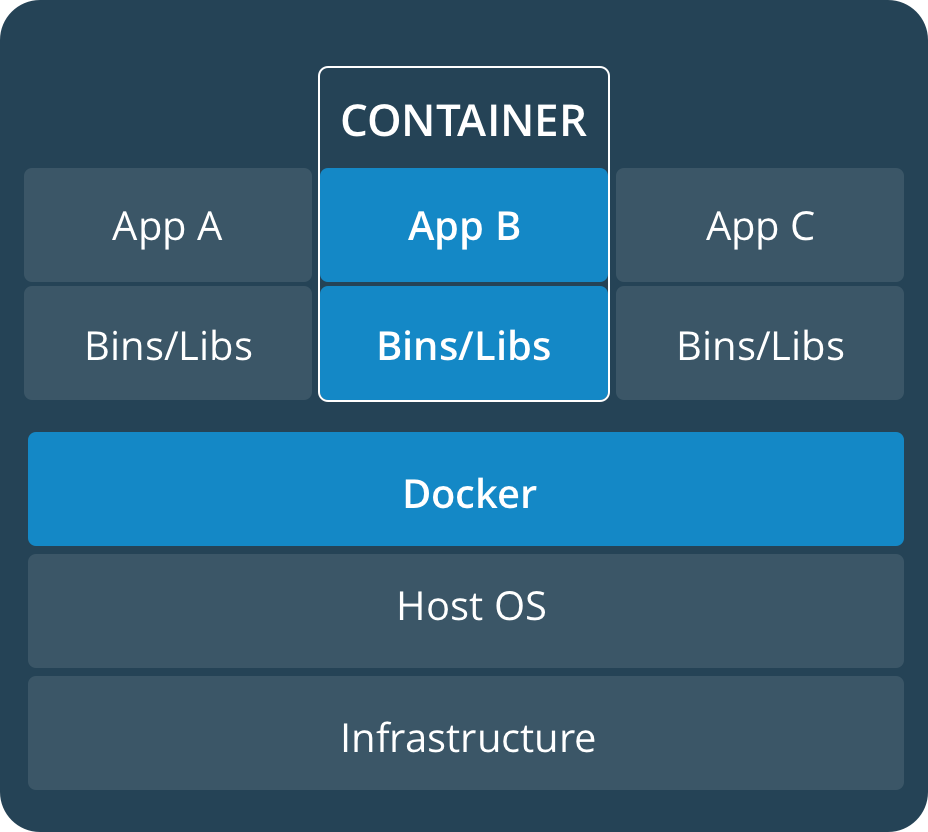
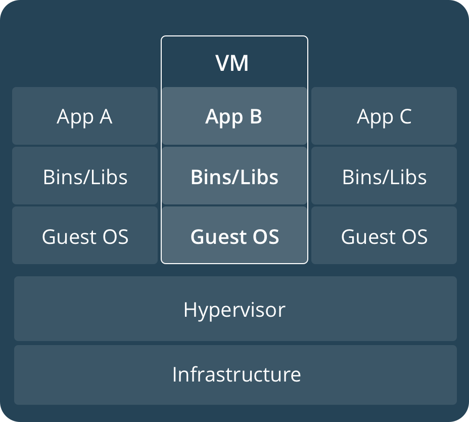
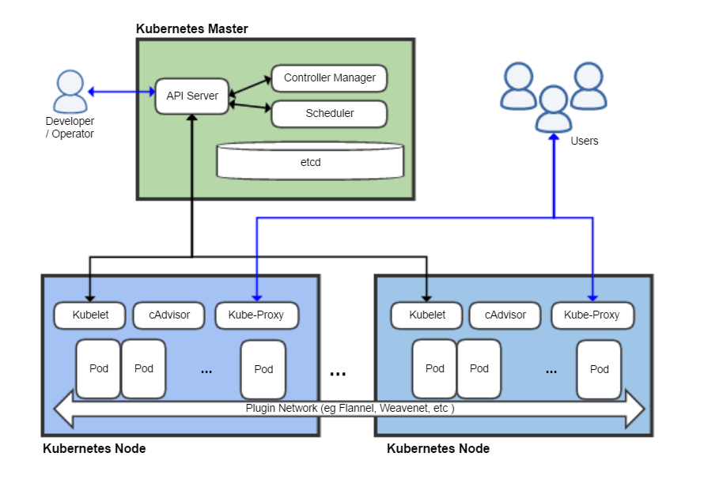

# Docker

## Introduction

- World's leading software container platform.
- Makes the process of application deployment very easy and efficient, and resolves a lot of issues related to deploying applications.
- Docker gives a standard way of packaging an application with all its dependencies in a container.
- Containers allow a developer to package up an application with all of the parts it needs — such as libraries and other dependencies — and ship it all out as one package.
- Understood well with the analogy of the shipping industry: standardized containers let goods (applications) move the same way regardless of the ship (infrastructure) carrying them.
- Docker simplifies DevOps.

### Benefits of Docker

- **Build once**: no worries that the application will behave differently than it did in the testing environment.
- **Portability**
- **Version control**
- **Isolation**
- **Productivity**

## Terminology

### Docker engine
- The software installed on the machine.
- Provides a client-server architecture.
- Comprises the server, client, and REST APIs.

### Docker daemon
- The Docker server (`dockerd`) is the daemon running on the machine on which Docker is installed.
- Manages images, containers, networks, and volumes.
- Can also interact with other daemons.
- Listens for REST-based client requests.

### Docker client
- The Docker client (`docker`) is used to make requests to the server.
- Requests are translated into REST API requests.
- All Docker commands are executed using this client.

### Image
- An immutable file that contains the blueprint for a container.
- One image can be based on another image.
- Images can be transferred from one machine to another, or shipped.
- Every official framework provides its own official image, on which customizations can be applied to build a custom image.
- Images are templates used to create containers; a container is a running instance of an image.

### Container
- An instance created from an image.
- Like a mini virtual machine.
- Runs on a machine; can be started, stopped, or removed.
- Changes are usually not made by going inside a container directly.
- A container image is a lightweight, stand-alone, executable package that includes everything needed to run it: code, runtime, system tools, system libraries, and settings.
- Features: lightweight; use fewer resources; boot very fast; can be started/stopped/killed/removed quickly; OS resources can be shared within Docker; containers run on the same machine sharing the same OS kernel, which makes them faster.

### Dockerfile
- A user-written file from which images are produced.
- Has its own syntax.
- Any change needed in a container has to be included in the Dockerfile.

### Registry
- A place where images are stored.
- Can be local (deployed by running the registry container available on Docker Hub).
- Images hosted on a registry can be pulled from a different machine running Docker.
- Docker images can also be transferred in tar format.

### Docker Hub
- The official registry hosted by Docker.
- Anyone can upload and download images from it.
- Official images are marked as such.
- Public user images are accessible as `<username>/<imagename>`.

## Virtualization vs. Containerization

### Virtualization
- Hardware is virtualized — network, storage, memory.
- A new operating system runs on this virtual machine.
- KVM (Kernel-based Virtual Machine) is available for Linux.
- VMware is also a popular virtualization option.

### Containerization
- No separate operating system is required — it runs on the existing OS of the machine.
- The concept of **namespaces** enabled containerization.
- Six namespaces are available for Linux kernels: mount, UTS, IPC, PID, network, and user namespaces.
- Namespaces can also be used directly (via Linux commands) to create your own isolated environment.

### Docker vs. Virtual Machine

Containers share the host OS kernel through the Docker engine, whereas each virtual machine runs its own full guest OS on top of a hypervisor:





## Installing Docker

### On Linux
**Prerequisites**
- OS should be 64-bit.
- Linux kernel version 3.10 or greater (`uname -r` to check).

**Steps**
1. Connect to the Linux system.
2. Install Docker:
   - `sudo yum -y update`
   - `sudo yum install -y docker`
   - `docker --version`
3. Start Docker:
   - `sudo service docker start`
   - `sudo usermod -a -G docker "user"`
   - `docker info`
   - `docker run hello-world` — runs the hello-world image
   - `docker images` — lists images present locally
   - `docker ps` — lists running containers
   - `docker ps -a` — lists all containers
4. Stop Docker:
   - `sudo service docker stop`
   - Uninstall: `sudo yum remove docker`

**References**
- [Docker install script](https://get.docker.com/)
- [Docker basics on Amazon ECS](https://docs.aws.amazon.com/AmazonECS/latest/developerguide/docker-basics.html)
- [AWS free tier](https://aws.amazon.com/free/)
- [Docker manuals](https://docs.docker.com/manuals/)

## Basic Commands

### General
- `docker search <image>` — search images on Docker Hub
- `docker images` — list all available images on the system
- `docker ps -a` — list all available containers on the system
- `docker pull <image>` — pull image from a registry
- `docker rmi <image>` — remove an image
- `docker run <image>` — run a container from an image
- `docker start <container>` — start a container
- `docker stop <container>` — stop a container
- `docker attach <container>` — attach to a running container
- `docker rm <container>` — remove a container
- `docker exec <container> <cmd>` — execute a command inside a container
- `docker system prune` — free unused resources
- `sudo usermod -aG docker $USER` — add user to the docker group
- `docker version` / `docker -v` / `docker info` / `docker --help` / `docker login`

### Images
- `docker images --help`
- `docker pull image`
- `docker images` / `docker images -q`
- `docker images -f "dangling=false"` / `docker images -f "dangling=false" -q`
- `docker run image`
- `docker rmi image` / `docker rmi -f image`
- `docker inspect`
- `docker history imageName`
- Images can be stored locally or in a remote registry (e.g. Docker Hub).

### Containers
- `docker ps`
- `docker run ImageName`
- `docker start / stop / pause / unpause ContainerName/ID`
- `docker top ContainerName/ID` / `docker stats ContainerName/ID`
- `docker attach ContainerName/ID` / `docker kill ContainerName/ID` / `docker rm ContainerName/ID`
- `docker history ImageName/ID`
- `docker container create` — create a container in a stopped state

### System
- `docker stats`
- `docker system df`
- `docker system prune`

## Building an Image from a Dockerfile

A Dockerfile is a text file with instructions to build an image — it automates image creation. Key instructions: `FROM`, `RUN`, `CMD`.

**Steps**
1. Create a file named `Dockerfile`.
2. Add instructions to the Dockerfile.
3. Build the Dockerfile to create an image: `docker build -t ImageName:Tag directoryOfDockerfile` (the `.` indicates the path where the Dockerfile is kept, and `-t` names/tags the image).
4. Run the image to create a container: `docker run image`.

Once built, `docker run` creates and starts the container. Useful flags:
- `-d` — run in detached mode (background)
- `-i` — keep STDIN open even if not attached
- `-t` — allocate a pseudo-TTY
- `-p 80:80` — map a port
- `-v my_vol:/usr/data` — map a volume
- `-v /usr/data:/usr/data` — map a bind mount
- `--restart=always` — restart the container automatically
- `--name my_container` — give the container an alias
- `-h my_hostname` — give the container a hostname

If the container is stopped, restart it with `docker start -i my_container` (`-i` attaches STDIN).

If already running, `docker attach my_container` attaches the terminal's stdin/stdout/stderr (`--detach-keys` customizes the detach sequence; `-t` is used if the container has no pseudo-TTY).

**References**
- [Docker cheat sheet — Dockerfile](https://github.com/wsargent/docker-cheat-sheet#dockerfile)
- [Dockerfile reference — environment replacement](https://docs.docker.com/engine/reference/builder/#environment-replacement)
- [docker ps reference](https://docs.docker.com/engine/reference/commandline/ps/)
- [Docker container command reference](https://docs.docker.com/engine/reference/commandline/container/#child-commands)
- [Docker Hub](https://hub.docker.com/)
- [Docker images reference](https://docs.docker.com/engine/reference/commandline/images/)

## Hosting an Image on a Registry

Once an image is built from a Dockerfile, it should be hosted on a registry so it can be pulled onto a different machine for deployment. A registry can be local (running on a machine) or Docker Hub.

For a local registry, pull the official registry image and deploy it per [this guide](https://docs.docker.com/registry/deploying/). Every registry is identified by a URL or reference — for a local registry, this is typically an IP address and port, e.g. `192.168.3.65:5000`. Images on a registry are accessed as `my_registry_ref/my_image:my_tag`, e.g. `192.168.3.65:5000/python_server:latest`.

- Tag the image before pushing: `docker tag my_image my_registry_ref/my_image:my_tag`
- Push the tagged image: `docker push my_registry_ref/my_image:my_tag`
- Pull the image from any machine: `docker pull my_registry_ref/my_image:my_tag`

If manual changes were made to a running container that can't be captured in the Dockerfile, they can be committed to a new image version: `docker commit -m "my_message" my_container my_registry_ref/my_image:my_tag`. This type of image versioning is discouraged — the Dockerfile should be sufficient to define the state of an image.

View registry contents in a browser:
- `http://my_registry_ref/v2/_catalog`
- `http://my_registry_ref/v2/my_image/tags/list`

If the registry doesn't support TLS/SSL, mark it as insecure on the pulling machine:
- `vim /etc/docker/daemon.json`
- `{ "insecure-registries": ["my_registry_ref"] }`
- `/etc/init.d/docker restart`

## Docker Compose

- A tool for running multi-container Docker applications.
- Uses a YAML file, `docker-compose.yml`, to configure application services (the parameters normally passed to `docker run` are written into this file).
- `docker compose up` / `docker-compose up -d` — start all defined services
- `docker compose down` / `docker-compose down` — stop all services
- Can scale up selected services when required: `docker-compose up -d --scale database=4`
- **Kompose** is a tool used to convert a Docker Compose YAML file to a Kubernetes YAML file.

**Setup**
1. Install Docker Compose (already bundled with Docker on Windows and Mac). On Linux, either:
   - Download from [docker/compose releases](https://github.com/docker/compose/releases), or
   - `pip install -U docker-compose`
2. Check version: `docker-compose -v`
3. Create a `docker-compose.yml` file at any location on the system.
4. Validate the file: `docker-compose config`
5. Run it: `docker-compose up -d`
6. Bring the application down: `docker-compose down`

**References**
- [Docker Hub](https://hub.docker.com/)
- [docker/compose releases](https://github.com/docker/compose/releases)
- [Compose file reference](https://docs.docker.com/compose/compose-file/)

## Docker Volumes

- Volumes are the preferred mechanism for persisting data generated by and used by containers.
- Can be shared across different containers; attaching a volume to a container means it won't be deleted if the container is removed.
- Commands: `docker volume create`, `docker volume ls`, `docker volume inspect`, `docker volume rm`, `docker volume prune`.
- By default, files created inside a container are stored on a writable container layer. This data doesn't persist once the container stops, and a container's writable layer is tightly coupled to the host machine it's running on — the data can't easily be moved elsewhere.
- Docker offers two options for containers to store files on the host machine so they persist after the container stops: **volumes** and **bind mounts**.

### Volumes vs. Bind Mounts
- Volumes are stored in a part of the host filesystem managed by Docker; non-Docker processes should not modify this part of the filesystem.
- Bind mounts may be stored anywhere on the host system as normal files, referenced by their full path, and can be modified by non-Docker processes at any time.
- Volumes are the best way to persist data in Docker — they are managed by Docker and isolated from the core functionality of the host machine.
- A given volume can be mounted into multiple containers simultaneously.
- When no running container is using a volume, it's still available to Docker and isn't removed automatically — remove unused volumes with `docker volume prune`.
- A mounted volume may be named or anonymous (anonymous volumes aren't given an explicit name when first mounted).
- Volumes also support volume drivers, which allow storing data on remote hosts or cloud providers, among other possibilities.

**Example commands**
```
docker run --name MyJenkins1 -v myvol1:/var/jenkins_home -p 8080:8080 -p 50000:50000 jenkins
docker run --name MyJenkins2 -v myvol1:/var/jenkins_home -p 9090:8080 -p 60000:50000 jenkins
docker run --name MyJenkins3 -v /Users/raghav/Desktop/Jenkins_Home:/var/jenkins_home -p 9191:8080 -p 40000:50000 jenkins
```

**Reference**
- [Docker storage volumes docs](https://docs.docker.com/storage/volumes/)

## References
- [Play with Docker](https://labs.play-with-docker.com/)
- [How To Install and Use Docker on Ubuntu 18.04](https://www.digitalocean.com/community/tutorials/how-to-install-and-use-docker-on-ubuntu-18-04)
- [Deploy a registry server](https://docs.docker.com/registry/deploying/)

---

# Kubernetes

## What Is Kubernetes?
- The word means "pilot" (helmsman).
- An open-source container-orchestration system for automating application deployment, scaling, and management.
- Google open-sourced the Kubernetes project in 2014.

## Why You Need Kubernetes
- In a production environment, to manage the containers.
- To ensure no downtime.
- Takes care of scaling and failover for the application.
- That's where Kubernetes comes to the rescue — it provides a framework to run distributed systems resiliently.

## What It Can Do
- Service discovery and load balancing — scalability
- Storage orchestration
- Automated rollouts and rollbacks
- Self-healing
- Secret and configuration management
- Runtime configuration
- Monitoring and reporting

## Kubernetes Architecture



- When you deploy Kubernetes, you get a **cluster**.
- A Kubernetes cluster consists of a set of worker machines, called **nodes**.
- The worker node(s) host the pods that are the components of the application.
- Each node contains the services necessary to run pods. Node components include `kubelet`, `kube-proxy`, etc.
- The **Control Plane** manages the worker nodes and the pods in the cluster.
- The Control Plane's components make global decisions about the cluster (for example, scheduling), and detect and respond to cluster events.
- Control Plane components include `kube-apiserver`, `kube-scheduler`, `etcd`, `kube-controller-manager`, etc.
- The `kubelet` takes a set of PodSpecs and ensures that the containers described in those PodSpecs are running and healthy.

## Kubernetes Resources

### Pod
- Basic execution and scheduling unit.
- Represents processes running on the cluster.
- Encapsulates container(s), storage resources, a unique network IP, shared namespaces, and options that govern how the container(s) should run.
- Containers within a pod share an IP address and port space, and can communicate via `localhost`.
- Inter-pod communication happens via pod IP addresses.

### Service
- An abstraction which defines a set of pods and a policy by which to access them.
- Each service is assigned a unique IP address (also called a clusterIP).

### Ingress
- Exposes HTTP and HTTPS routes from outside the cluster to services within the cluster.
- Traffic routing is controlled by rules defined on the Ingress resource.

### Volume
- A Kubernetes volume has an explicit lifetime — the same as the pod that encloses it.

### PV (PersistentVolume)
- A piece of storage in the cluster that has been provisioned by an administrator, or dynamically provisioned using Storage Classes.
- It is a resource in the cluster, just like a node is a cluster resource.
- Its lifecycle is independent of any individual pod that uses it.

### PVC (PersistentVolumeClaim)
- A request for storage by a user.
- Pods consume node resources; PVCs consume PV resources.

### ConfigMaps and Secrets
- Let you store and manage sensitive information, such as passwords, OAuth tokens, and SSH keys.
- Allow configuration changes to be made without requiring an application rebuild.

### Namespaces
- A partitioning of the cluster's resources into non-overlapping sets.
