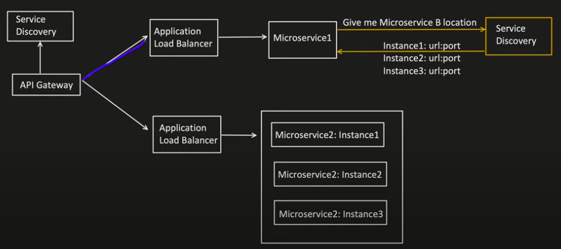
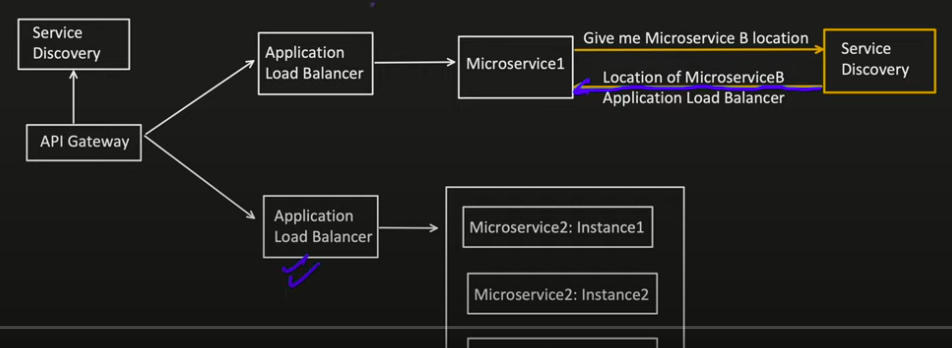
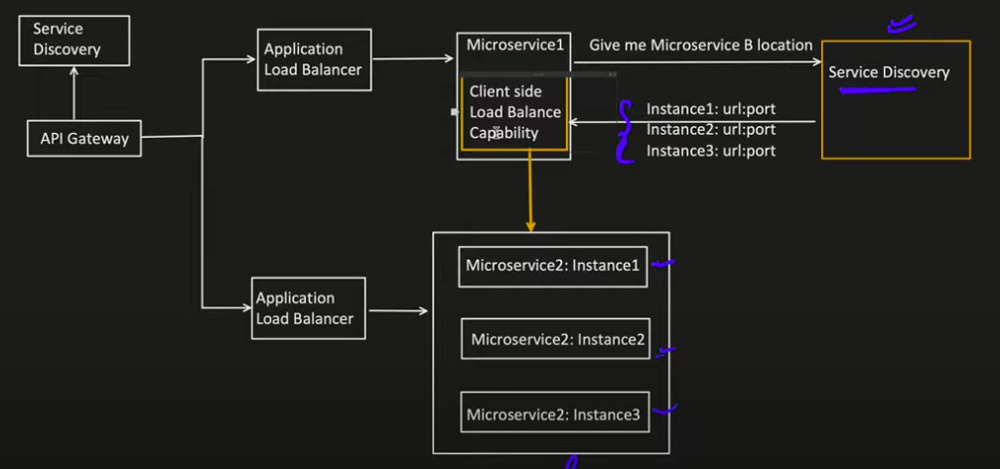
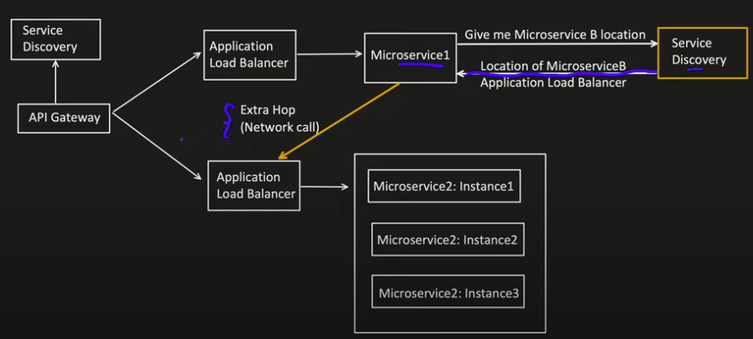
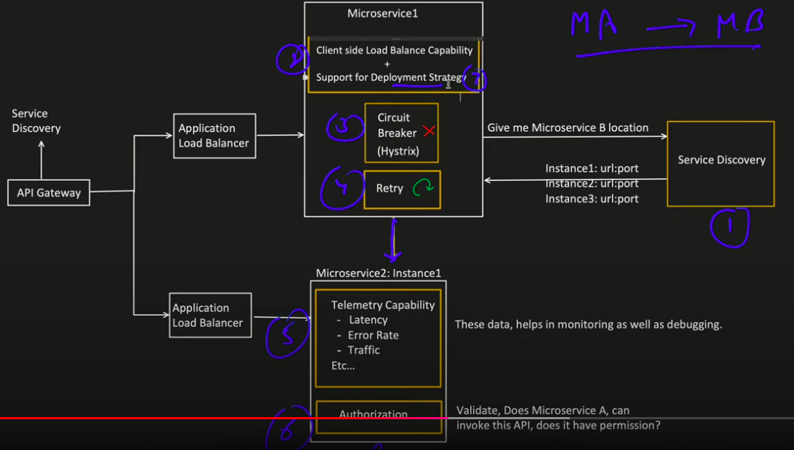
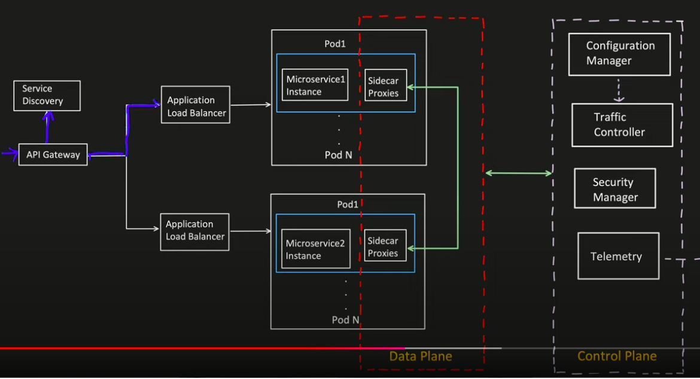

**How 2 different Microservices communicate with each other?**

- Service Discovery Capability:
  - Microservice A wants to communicate with Microservice B. Then it need its location (IP address and port no).
  - Service Discovery functionality is required so that Microservice A can get the location of Microservice B different instances.
  - Scenario1: Service Discovery returns all the Microservice B instances location.
  
  - Scenario2: Service discovery returned the address of Microservice B Application load balancer
  
- Load Balancing Capability:
  - Scenario1: Microservice A got the Microservice B instances location and now want Load Balancing capability to equally distribute the traffic to Microservice B.
  
  - Scenario2: Microservice A got the Microservice B Application load balancer address and now need to invoke that. Extra Network call is required, which might cause latency issue.
  
- Authentication and Authorization Capability:
  - Validate if microserviceA is allowed to call microserviceB
- Circuit Breaker Capability
  - To do not call service for a defined time if defined no of requests already failed
- Retry Capability
  - To retry for all retryable error code (5XX)
- Deployment strategy
  - There are different deployment strategy like Canary, Red-Black, Blue-Green etc.
  - For example: In Canary, I want 90% traffic on Old and 10% on new initially, and gradually increase the number on new manifest.
  - Generally Load balancer helps to control this, means "Client side load balancer also has to handle this different deployment strategy"
- Telemetry Capability
  - It means, we need to collect data which will help in analysis and monitoring of a component.

**Service Mesh is better solution**

- In Kubernetes, each instance is knowns as pod, Sidecar Proxies is attached to each pod and which can directly interact with other microservice Sidecar proxies
- Sidecar proxies have all the capabilities, LB, deployment strategy, etc.. whcich can be controlled using Control Plane
- Eg Istio:
  - SideCar Proxy known as Envoy
  - Configuration Manager known as Galley
  - Traffic Controller known as Pilot
  - Security Manager known as Citadel
- 
