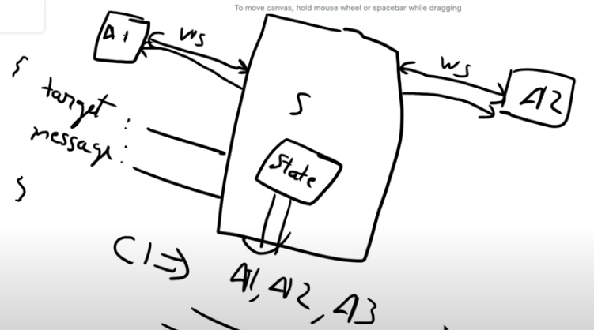
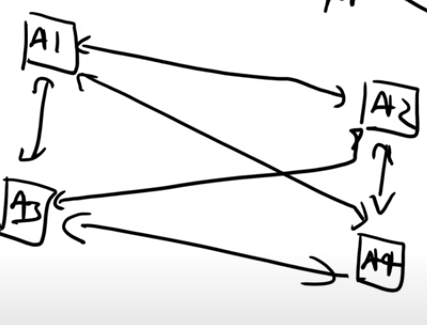
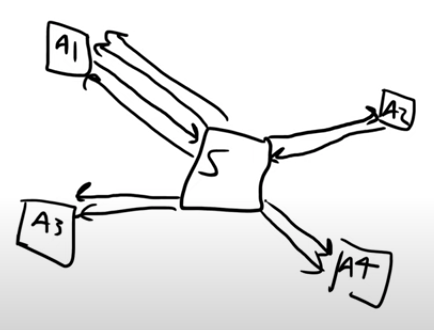
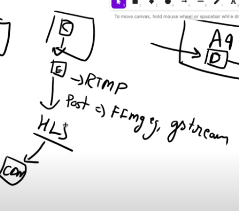

## High-Level Design for a Video Calling Application

Video calling app has 2 parts : Chat and Real time Video call

### System Requirements

#### Functional Requirements
- One-to-one video calls
- Group video conferencing
- Text chat during calls
- Screen sharing
- Call recording (optional)
- User presence (online/offline status)

#### Non-Functional Requirements
- Low latency (< 150ms for real-time communication)
- High availability (99.99% uptime)
- Scalability to support millions of concurrent users
- Security (end-to-end encryption)
- Quality adaptation based on network conditions

### Architecture Overview

The system consists of several key components:

1. **Client Applications**
   - Web application (browser-based)
   - Mobile applications (iOS, Android)
   - Desktop applications

2. **Signaling Server**
   - Manages WebSocket connections
   - Handles authentication and session management
   - Coordinates call setup and teardown

3. **Media Servers**
   - Handles media processing and routing
   - Supports Selective Forwarding Unit (SFU) or Multipoint Control Unit (MCU) architecture

4. **TURN/STUN Servers**
   - Assists with NAT traversal
   - Provides relay services when direct peer connections aren't possible

5. **Database**
   - Stores user profiles, call history, and settings
   - Manages persistent chat messages

6. **Authentication Service**
   - Handles user registration and login
   - Issues JWT tokens for secure access

### Chat Component

- Real time system
  - Long polling and web socket
  - Once a chatroom (c1) started, we will authenticate its participants using JWT and establish their WS connection with server
  - 

#### Chat System Details

1. **Connection Establishment**
   - Client establishes WebSocket connection with signaling server
   - Authentication via JWT tokens
   - Server maintains active connections in memory or distributed cache

2. **Message Flow**
   - Client sends message to server via WebSocket
   - Server validates message and routes to recipient(s)
   - Recipients receive message via their WebSocket connections
   - Server stores messages in database for persistence

3. **Scaling Considerations**
   - WebSocket connections are stateful and resource-intensive
   - Use load balancers with sticky sessions
   - Implement connection pooling and rate limiting
   - Consider Redis or similar for distributed session management

### Video Calling Component

- We will be using webRTC for video call and not websocket since we require a reactive kind of thing which will react to metadata. Eg if connection is slowing down, then reduces video quality data
  - Firstly, handshaking happens and then peers start transfering data

  - Here every peer is connected to each and every peer in the network which can hamper scale
  - To optimize this we can introduce a server in b/w which can act as a broadcaster to all the peers

#### WebRTC Architecture Details

1. **WebRTC Protocol Stack**
   - **Media Transport**: RTP/SRTP for audio/video transmission
   - **Data Channel**: SCTP for arbitrary data (chat, file sharing)
   - **Connection Establishment**: ICE, STUN, TURN for NAT traversal
   - **Signaling**: Not specified by WebRTC (typically WebSockets)

2. **Call Setup Process**
   - **Signaling**: Exchange session descriptions (SDP) via signaling server
   - **ICE Candidate Exchange**: Discover network paths between peers
   - **Media Negotiation**: Agree on codecs, resolution, and other parameters
   - **Connection Establishment**: Direct peer connection or via TURN relay

3. **Peer-to-Peer vs. Server-Mediated Architecture**
   - **Mesh Topology** (P2P): Each participant connects directly to every other participant
     - Pros: Lower server costs, potentially lower latency
     - Cons: Doesn't scale beyond 4-6 participants (O(n²) connections)

   - **Selective Forwarding Unit (SFU)**:
     - Server receives streams from all participants
     - Selectively forwards streams to each participant
     - Each participant sends one stream but receives multiple
     - Better scaling than mesh (O(n) connections)
     - Used by most modern video conferencing systems

   - **Multipoint Control Unit (MCU)**:
     - Server receives, decodes, combines, and re-encodes streams
     - Each participant sends and receives only one stream
     - Highest server resource usage but lowest client requirements
     - Best for limited bandwidth or processing power clients

### Alternative Streaming Methods

- There is another way to stream, using RTMP, HLS and CDN

#### Streaming Protocols Comparison

1. **RTMP (Real-Time Messaging Protocol)**
   - Originally developed by Macromedia for Flash
   - Low latency (2-5 seconds)
   - Not supported in modern browsers without Flash
   - Still used for ingestion in streaming workflows
   - Good for live streaming to large audiences

2. **HLS (HTTP Live Streaming)**
   - Developed by Apple
   - Higher latency (5-30 seconds)
   - Widely supported across devices
   - Uses standard HTTP delivery
   - Adaptive bitrate for varying network conditions
   - Ideal for one-to-many broadcasting

3. **DASH (Dynamic Adaptive Streaming over HTTP)**
   - Open standard alternative to HLS
   - Similar characteristics to HLS
   - Better support for advanced codecs

4. **WebRTC**
   - Sub-second latency
   - Peer-to-peer capable
   - Built into modern browsers
   - Higher server resources for many participants
   - Ideal for interactive video calls

### Scaling Challenges and Solutions

1. **Signaling Server Scaling**
   - Horizontal scaling with load balancers
   - WebSocket connection management
   - Use Redis or similar for distributed state

2. **Media Server Scaling**
   - Geographic distribution to reduce latency
   - Auto-scaling based on regional demand
   - Consider specialized hardware for transcoding

3. **TURN Server Scaling**
   - Significant bandwidth requirements
   - Geographic distribution is critical
   - Consider managed TURN services

4. **Quality vs. Bandwidth Tradeoffs**
   - Adaptive bitrate based on network conditions
   - Simulcast (sending multiple quality levels)
   - Bandwidth estimation and congestion control

### Security Considerations

1. **Authentication and Authorization**
   - JWT for secure authentication
   - Role-based access control for rooms
   - Rate limiting to prevent abuse

2. **Media Encryption**
   - DTLS for key exchange
   - SRTP for media encryption
   - Consider end-to-end encryption options

3. **Privacy Concerns**
   - Clear data retention policies
   - User consent for recording
   - Secure storage of recordings

### Monitoring and Quality Assurance

1. **Key Metrics**
   - Call setup time
   - Media quality metrics (packet loss, jitter, latency)
   - User engagement statistics

2. **Logging and Debugging**
   - Client-side logging with opt-in for detailed diagnostics
   - Server-side logging for system health
   - Real-time alerting for service degradation

### Implementation Technologies

1. **Client Technologies**
   - Browser: WebRTC API, WebSockets
   - Mobile: Native WebRTC libraries
   - Cross-platform: React, Flutter, Electron

2. **Server Technologies**
   - Signaling: Node.js, Go, or similar for WebSocket handling
   - Media Servers: Janus, Kurento, MediaSoup
   - TURN/STUN: coturn, restund

3. **Cloud Services**
   - Consider managed WebRTC services (Twilio, Agora, etc.)
   - CDN for static assets
   - Global load balancing
